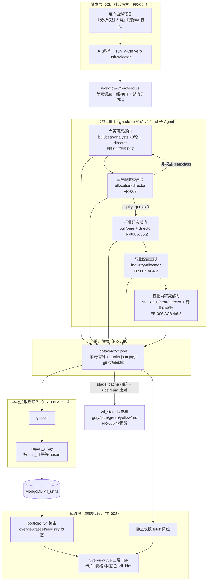
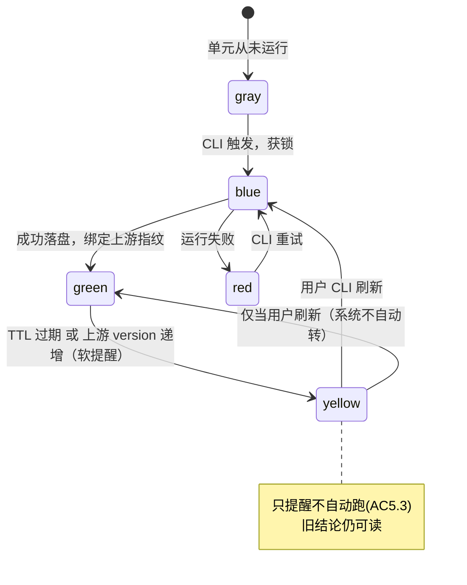

# 技术设计 — v4：分层独立深度投研系统

> 本设计基于 `requirements.md`（9 条 FR + 5 条 NFR），将 v3「一次全量单链路」重构为「分层、单元化、独立触发、增量缓存、约束链一致性」的常驻深度投研体系。
> 设计铁律延续 v3：**所有 LLM 决策走 `.md` 子 Agent + Workflow 编排（claude -p 驱动），Python 不直接 `llm.invoke()`**；运行态存 MongoDB，git 传输用单元粒度 JSON。
> 项目大类：existing / web-fullstack（FastAPI + Vue3 + MongoDB）。技术栈沿用，未新增框架。

---

## 一、核心设计抽象：分析单元（Analysis Unit）

v4 的一切围绕「**分析单元**」展开——它是触发、缓存、落盘、状态、约束链的最小原子。这是把 v3「单链路阶段（stage）」升维成「可独立调度的单元（unit）」的关键。

### 1.1 单元类型与稳定 ID

| 单元类型 | unit_id 格式 | 部门 | 下钻 | 对应 FR |
|----------|-------------|------|------|---------|
| 大类分析 | `asset:<class>` | 大类研究部门 | 7 个固定 class | FR-002/FR-007 |
| 资产配比 | `alloc:portfolio` | 资产配置委员会 | 单例 | FR-003 |
| 行业深辩 | `industry:<name>` | 行业研究部门 | 仅权益 | FR-006 |
| 行业间配比 | `alloc:equity_industries` | 行业配置团队 | 单例（权益内） | FR-006 |
| 个股分析 | `stock:<code>` | 行业内研究部门 | 仅权益 | FR-006 |
| 行业内配比 | `alloc:industry:<name>` | 行业内研究部门 | 每 Go 行业一个 | FR-006 |
| 非权益方案 | `plan:<class>` | 大类研究部门（复用） | 6 个非权益 class | FR-007 |

> 七大类 `class` 枚举（固定）：`equity`(权益) / `fixed_income`(固定收益) / `cash`(现金及等价物) / `commodity`(大宗商品) / `precious_metal`(贵金属) / `real_estate`(房地产) / `alternative`(另类投资)。

### 1.2 统一单元信封（落盘 schema 的外壳，FR-009 同构核心）

每个单元一个稳定路径 JSON，**外壳统一、payload 按单元类型差异化**——这是「本地运行 / AI 代跑产物同构」「幂等 upsert」「快照指纹」三件事的共同地基：

```jsonc
{
  "unit_id": "industry:AI算力",        // 稳定唯一键（upsert 主键）
  "unit_type": "industry",
  "schema_version": "v4.0",
  "version": 7,                          // 每次重跑 +1（下游引用此号判 stale）
  "fingerprint": "sha256:...",           // 本单元输入内容指纹（复用 stage_cache 算法）
  "upstream": [                          // 本单元依据的上游版本（FR-005 链路追溯）
    {"unit_id": "alloc:portfolio", "version": 3, "fingerprint": "sha256:..."},
    {"unit_id": "asset:equity",    "version": 5, "fingerprint": "sha256:..."}
  ],
  "status": "green",                     // gray|blue|green|yellow|red（运行态计算，落盘记最近值）
  "ttl_days": 7,
  "generated_at": "2026-06-06T16:40:00Z",
  "run_mode": "ai_proxy",                // local | ai_proxy（仅元信息，前端解析不区分）
  "error": null,
  "payload": { /* 按 unit_type 不同，见 §4 各部门产物 schema */ }
}
```

---

## 二、需求追溯（每条 AC → 设计）

### FR-001 七大类体系与穿透归类
| AC | 设计方案 |
|----|----------|
| AC1.1 | `v4_classifier.py` 扩展现有 `industry_classifier.py`/`exposure_service.py` 的穿透逻辑，输出 7 大类归类；无法归类入 `class=unclassified` 桶并在 overview 标「待人工归类」，不丢弃 |
| AC1.2 | 单元 payload 内 `tradable` 标的列表 vs `holding_only` 敞口分离；持有型（实物房产/实物贵金属/各国现金）只记 `exposure_amount`，不产 candidates |
| AC1.3 | 七大类配置表 `ASSET_CLASSES`（含 `max_drill_depth` 字段）内置于 `app/services/v4/asset_classes.py` 与前端常量；前端据此决定 Tab2 渲染「行业+个股」还是「持有结构方案」 |
| AC1.4 | 归类入口同时支持 Mongo 持仓与 `--portfolio-file` JSON（复用 `collect_data.py` 文件输入模式），AI 代跑走文件路径 |

### FR-002 大类逐类深度分析部门（3 轮辩论 + 总监）
| AC | 设计方案 |
|----|----------|
| AC2.1 | 大类研究部门 agent 输入拼装多维数据包：宏观（复用 `data_macro.json`/`market_signals.py`）、基本面/估值、舆情资金面、政策地缘；缺数据源时降级为「LLM 知识 + 可得行情」并 evidence 标 `missing` |
| AC2.2 | 对立角色 `v4-asset-bull.md`（多头研究员）vs `v4-asset-bear.md`（空头研究员）+ 专项 `v4-asset-analyst-macro/flow/policy`；编排器固定循环 **3 轮**，每轮 append 到 `debate_rounds[]` |
| AC2.3 | `v4-asset-director.md`（大类部门总监）读 3 轮辩论 → 输出 `verdict`：形势研判/方向(看多/看空/中性)/主要风险/建议趋势 |
| AC2.4 | 每大类落 `data/v4/assets/<class>.json` 独立单元，独立 version/generated_at/status，互不覆盖（单元化天然隔离） |
| AC2.5 | 零持仓大类仍可触发（CLI `分析<大类>`）；`tradable` 候选可空，分析聚焦「是否值得择机配置」 |

### FR-003 资产配比决策与约束下传
| AC | 设计方案 |
|----|----------|
| AC3.1 | `alloc:portfolio` 单元读 7 个 `asset:*` 单元最新 verdict；缺失/stale 的类在 payload `input_warnings[]` 标注，前端展示「先补跑或带风险继续」 |
| AC3.2 | `v4-allocation-director.md`（配置委员会总监）输出 `assets[]`：current_weight→target_weight + action + reasoning，**校验 Σtarget=100** |
| AC3.3 | target_weight 允许 0；payload 区分 `actively_zeroed:true`（主动归零 + reasoning）与缺失；Σ 校验仍含归零类（贡献 0） |
| AC3.4 | payload `equity_quota` = 权益 target_weight，写入 `alloc:portfolio`，下游 `alloc:equity_industries` 引用为权重上限；`equity_quota==0` 时编排器跳过权益深链并在 overview 标「本期不配置权益」 |
| AC3.5 | `alloc:portfolio` 信封 `upstream[]` 记 7 个 `asset:*` 的 version+fingerprint，供下游一致性校验 |

### FR-004 触发机制与新鲜度状态机
| AC | 设计方案 |
|----|----------|
| AC4.1 | 主入口 CLI 对话：AI 解析自然语言 → `scripts/run_v4.sh <verb> <unit-selector>`；等价脚本子命令供本地直接调用（见 §5.2） |
| AC4.2 | 上游更新 → `v4_state.py` 级联置黄（软提醒，不自动跑）；可选 `run_v4.sh scan` 扫过期单元仅置黄 |
| AC4.3 | TTL 分档配置于 `asset_classes.py`/编排 CACHE：大类配置 TTL、行业 TTL、个股 TTL 各一档，可改 |
| AC4.4 | 单元选择器只跑命中单元；状态各自独立（单元化隔离，FR-009 覆盖式不动他单元） |
| AC4.5 | 每单元信封落盘 status/generated_at/ttl_days/upstream/产物路径；`_units.json` 索引汇总 |
| AC4.6 | overview/详情接口为每单元返回 `cli_hint`（自然语言 + 等价脚本命令），前端展示但不提供「点即跑 LLM」按钮 |
| AC4.7 | 运行锁：`data/v4/_locks/<unit_id>.lock`（含 pid+ts）；重复触发去重/排队，blue 态拒绝并发重入 |

### FR-005 约束链一致性与 stale 软提醒
| AC | 设计方案 |
|----|----------|
| AC5.1 | 下游信封 `upstream[]` 记上游 version+fingerprint（人读提示如「基于 alloc v3、asset:equity v5」） |
| AC5.2 | 上游 version 递增后，`v4_state.py` 计算下游 status=yellow，overview 返回 `stale_reason`（如「行业配比基于 3 天前资产配置，建议刷新」） |
| AC5.3 | 状态机只置黄、绝不自动重跑、不阻断读取 stale 产物（软提醒语义） |
| AC5.4 | 刷新下游时重新绑定当前最新上游 version/fingerprint，status 回 green |
| AC5.5 | 约束传递（equity_quota 等）校验：下游引用的上游 version < 上游当前 version → 仅报警不修正数值 |

### FR-006 权益深链（深辩→行业配比→个股→行业内配比）
| AC | 设计方案 |
|----|----------|
| AC6.1 | `app/services/v4/industry_candidates.py` 内置候选行业清单（风口 + 长期主题）；CLI 对话由 AI 询问/推荐「先分析哪些行业」，用户自选或采纳 |
| AC6.2 | `industry:<name>` 单元先跑：`v4-industry-bull/bear` 多轮辩论 + `v4-industry-director` 定方向（景气/空间/风险/配置建议）——**早于配比** |
| AC6.3 | `alloc:equity_industries` 单元后跑：`v4-industry-allocator` 读各 `industry:*` verdict，Σ行业权重 ≤ equity_quota；缺/stale 行业在 payload 标注 |
| AC6.4 | `stock:<code>` 单元：`v4-stock-bull/bear + v4-stock-director`，每只个股**独立单元独立缓存**，产评级/目标价 |
| AC6.5 | `alloc:industry:<name>` 单元：在该行业目标权重内对选定个股配比，产目标权重 + 买入区间 |
| AC6.6 | 链路：`industry:*` 变 → `alloc:equity_industries` 黄；`alloc:equity_industries` 变 → `alloc:industry:*` 黄（upstream 指纹驱动，§3） |

### FR-007 非权益六类差异化方案
| AC | 设计方案 |
|----|----------|
| AC7.1 | `plan:<class>` 复用大类研究部门范式（bull/bear/director），director prompt 按 class 注入「方案产出模板」 |
| AC7.2 | cash：payload `holding_structure[]`（活期/货基/短债/逆回购建议分布 + 理由），持有型不荐个券 |
| AC7.3 | fixed_income：payload `duration_view` + `instrument_mix[]`（国债/信用债/可转债/债基 + 久期取向），结合利率 |
| AC7.4 | commodity/precious_metal：payload `instrument_mix[]`（实物/ETF/相关股），可交易工具 tradable 下钻、持有型记敞口 |
| AC7.5 | real_estate：REITs 工具下钻 tradable；实物房产 holding_only 记敞口 + 宏观持有建议 |
| AC7.6 | alternative：payload `instrument_mix[]` + 显著 `risk_flags[]`（高波动/合规） |
| AC7.7 | `plan:*` 同样走 §3 指纹/状态机（upstream = `asset:<class>` 自身分析 + macro） |

### FR-008 三层 Tab 前端
| AC | 设计方案 |
|----|----------|
| AC8.1 | Tab1 资产配置：7 张**卡片**（状态色 + 摘要 + current→target），复用/扩展 `Overview.vue` |
| AC8.2 | Tab2 大类详情（动态）：权益→行业**表格**（配比/状态/指标）；非权益→方案卡片/小表 |
| AC8.3 | Tab3 行业/个股（动态）：行业深辩报告 + 个股**表格**（评级/目标价/目标权重/状态） |
| AC8.4 | 各单元卡片/表格行展示状态色 + stale 软提醒文案 + `cli_hint`，无「点即跑 LLM」按钮 |
| AC8.5 | 缺数据显示空态 + CLI 触发引导，不报错/空白 |

### FR-009 双跑同构落盘解析
| AC | 设计方案 |
|----|----------|
| AC9.1 | 入口①本地（连 Mongo）②AI 代跑（`--portfolio-file`，不依赖用户 Mongo）；均经统一编排器 |
| AC9.2 | 两模式产同一信封 schema（§1.2），`run_mode` 仅元信息，前端解析一致 |
| AC9.3 | git 载体 = `data/v4/**/*.json` 单元文件（diff 友好可 review），非 dump/二进制 |
| AC9.4 | 重跑覆盖式更新单个单元文件 + version+1，不触碰他单元 |
| AC9.5 | `scripts/import_v4.py` 幂等 upsert（按 `unit_id` 主键）入 Mongo `v4_units`；前端三层 Tab 正确展示，与本地一致 |
| AC9.6 | `data/` 已在 .gitignore；含持仓/处方的单元文件遵循私有仓库约定（沿用 v3 隐私约束） |

### 非功能需求
| AC | 设计方案 |
|----|----------|
| NFR1.1/1.2 | 单元独立深跑落盘；读取接口走 Mongo 缓存产物秒级响应、不触发 LLM |
| NFR2.1/2.2 | 信封 upstream + version 全程可追溯；约束链校验仅软提醒不静默不修正 |
| NFR3.1/3.2 | 五色状态统一语言；失败/降级显式提示，延续 `run_report` 理念（v4 产 `run_report_v4`） |
| NFR4.1/4.2 | 同构 schema 双跑对齐；覆盖式落盘不破坏未重跑单元 |
| NFR5.1/5.2 | 敏感数据遵循 .gitignore/私有仓库；不硬编码密钥 |

---

## 三、现有实现分析（旧项目必须）

| 功能 | 文件 | 状态 | v4 处理 |
|------|------|------|---------|
| 阶段缓存 + 输入指纹 | `scripts/stage_cache.py` | ✅ 可直接复用 | 指纹算法（sha256 输入文件）正是 FR-005 所需，v4 单元指纹/upstream 比对复用其 `_fingerprint` |
| 编排器范式 | `scripts/workflow-v3-advisor.js` | 🔁 参考重写 | 新建 `workflow-v4-advisor.js`，从「线性 7 stage」改为「单元选择器 + 部门子流程」；`agent()`/`Bash()`/缓存门范式保留 |
| 数据采集 | `scripts/collect_data.py` | 🔁 扩展 | 复用文件输入模式 + 景气榜；新增非权益大类数据包拼装 |
| 落库 | `scripts/ingest_advice.py` | 🔁 参考 | 新建 `scripts/import_v4.py` 按 unit_id upsert `v4_units`（v3 ingest 保留不动） |
| 静态快照 | `scripts/build_snapshot.py` | 🔁 扩展 | 新增 v4 单元 → `frontend/public/snapshot/v4/*.json` 同构组装 |
| 运行报告 | `scripts/run_report.py` | 🔁 参考 | v4 单元级 run_report（停在哪/降级与否） |
| 两阶段 runner | `app/services/v3_advisor_runner.py` | ⛔ 不复用在线触发 | v4 触发走 CLI/本地，不经 Web；保留 v3 兼容 |
| 组合分析 API | `app/routers/portfolio_analysis.py` | ⛔ 保留 v3 | v4 新建只读 + 导入路由 `app/routers/portfolio_v4.py` |
| 概览 API | `app/routers/paper.py` | 🔁 参考 | v4 overview 读 `v4_units` 组装三层结构 |
| 穿透归类 | `app/services/industry_classifier.py`/`exposure_service.py` | 🔁 复用 | 扩展为 7 大类穿透 `v4_classifier.py` |
| 景气打分 | `app/services/industry_vitality.py` | ✅ 复用 | 权益行业候选推荐沿用 |
| 个股研究缓存 | `app/services/stock_research_cache.py` | 🔁 参考 | 个股单元缓存语义参考，迁到单元信封 |
| 前端总览 | `frontend/src/views/Portfolio/Overview.vue` | 🔁 重构 | 扩为三层 Tab（现已有 asset/industry/drawer 雏形） |
| v3 子 Agent ×17 | `agents/advisor/v3-*.md` | 🔁 参考 | v4 新建 `agents/advisor/v4-*.md` 部门角色；v3 保留 |
| 历史结论 | Mongo `portfolio_advice` | 🟰 并存 | v4 用独立 `v4_units` 集合，不迁移不删除 v3 |

> **v3/v4 关系决策**：并存。v4 写独立集合与独立文件目录、独立编排器与路由，v3 链路完全不动，可灰度切换、可回退。

---

## 四、架构设计

### 4.1 整体分层与单元流（Mermaid）



### 4.2 状态机（FR-004/FR-005）



### 4.3 约束链与快照指纹（FR-005 核心机制）

- 复用 `stage_cache.py::_fingerprint`：对单元输入文件集做 sha256。
- 单元落盘时：`version+1`，并把当前所有上游单元的 `{unit_id, version, fingerprint}` 写入本单元 `upstream[]`。
- 状态计算（`v4_state.py`，纯函数，不调 LLM）：
  1. 文件不存在 → gray；有锁且无产物 → blue；`error!=null` → red。
  2. 自身 `now - generated_at > ttl_days` → yellow。
  3. 任一 `upstream[i].version < 该上游当前 version`（或 fingerprint 不匹配）→ yellow + `stale_reason`。
  4. 否则 green。
- **不强制刷新**：状态只读计算，绝不触发重跑（AC5.3）。约束数值（equity_quota 等）发现来自过时上游 → 仅报警（AC5.5）。

---

## 五、详细设计

### 5.1 落盘文件结构（git 传输载体）

```
data/v4/                              # 已在 .gitignore（含敏感财务，私有仓库共享）
├── _units.json                       # 单元状态索引（id→version/status/ttl/upstream/path）
├── _locks/<unit_id>.lock             # 运行锁（去重/排队，AC4.7）
├── inputs/                           # collect 产物（持仓穿透 / 宏观 / 景气榜）
│   ├── portfolio_classified.json     # 7 大类穿透归类（FR-001）
│   ├── data_macro.json  data_vitality.json
├── assets/<class>.json               # 大类分析单元 ×7（FR-002）
├── plans/<class>.json                # 非权益方案单元 ×6（FR-007）
├── allocation/
│   ├── portfolio.json                # 七大类配比 + equity_quota（FR-003）
│   ├── equity_industries.json        # 行业间配比（FR-006 AC6.3）
│   └── industry_<name>.json          # 行业内个股配比（FR-006 AC6.5）
├── industries/<name>.json            # 行业深辩单元（FR-006 AC6.2）
├── stocks/<code>.json                # 个股分析单元（FR-006 AC6.4）
├── run_report_v4.json / .md          # 单元级运行报告（NFR3.2）
└── _snapshot/v4/*.json               # 前端静态快照（同构降级）
```

### 5.2 CLI 触发命令设计（FR-004）

| 自然语言（AI 解析） | 脚本命令 | 单元 |
|--------------------|----------|------|
| 分析<大类> | `run_v4.sh analyze asset:<class>` | 大类分析/非权益方案 |
| 跑资产配比 | `run_v4.sh analyze alloc:portfolio` | 配比 |
| 深辩<行业> | `run_v4.sh analyze industry:<name>` | 行业深辩 |
| 跑行业配比 | `run_v4.sh analyze alloc:equity_industries` | 行业间配比 |
| 分析个股<代码> | `run_v4.sh analyze stock:<code>` | 个股 |
| 跑<行业>内配比 | `run_v4.sh analyze alloc:industry:<name>` | 行业内配比 |
| 刷新<单元> | `run_v4.sh refresh <unit-selector>` | 强制失效重跑 |
| 看状态 / 哪些该刷新 | `run_v4.sh status` / `scan` | 状态机扫描（仅置黄） |

- AI 代跑：`run_v4.sh analyze <selector> --portfolio-file holdings.json`（不连用户 Mongo）。
- 锁机制：获锁失败（blue 态）→ 提示「该单元正在运行」并退出（AC4.7）。

### 5.3 部门 Agent 角色清单（新建 `agents/advisor/v4-*.md`）

| Agent 文件 | 角色 | 部门 | 输出 |
|-----------|------|------|------|
| `v4-asset-bull.md` | 多头研究员 | 大类研究 | 看多论点 + evidence |
| `v4-asset-bear.md` | 空头研究员 | 大类研究 | 看空/风险论点 + evidence |
| `v4-asset-analyst-macro.md` | 宏观视角分析师 | 大类研究 | 利率/通胀/周期 |
| `v4-asset-analyst-flow.md` | 资金/舆情视角分析师 | 大类研究 | 资金面/情绪 |
| `v4-asset-analyst-policy.md` | 政策/地缘视角分析师 | 大类研究 | 政策/地缘 |
| `v4-asset-director.md` | 大类部门总监 | 大类研究 | verdict：形势/方向/风险/趋势（含非权益方案模板） |
| `v4-allocation-director.md` | 资产配置委员会总监 | 配置委员会 | 7 大类 current→target + equity_quota |
| `v4-industry-bull.md` | 行业多头研究员 | 行业研究 | 景气/空间看多 |
| `v4-industry-bear.md` | 行业空头研究员 | 行业研究 | 景气拐点/风险 |
| `v4-industry-director.md` | 行业部门总监 | 行业研究 | 行业方向研判 |
| `v4-industry-allocator.md` | 行业配置总监 | 行业配置 | 行业间权重（≤equity_quota） |
| `v4-stock-bull.md` | 个股多头 | 行业内研究 | 标的看多 + 目标价 |
| `v4-stock-bear.md` | 个股空头 | 行业内研究 | 标的风险 |
| `v4-stock-director.md` | 行业内研究总监 | 行业内研究 | 个股评级/目标价 + 行业内配比 |

> 辩论轮次：大类/行业固定 3 轮（AC2.2），编排器循环 append `debate_rounds[]`，总监最后拍板。角色 prompt 沿用 v3 GROUNDING 凭据契约（evidence + verified/estimated/missing）。

### 5.4 关键 payload schema（按单元类型，FR-009 同构）

**asset:<class>（大类分析，FR-002）**
```jsonc
"payload": {
  "asset_class": "equity",
  "debate_rounds": [{"round":1,"bull":"...","bear":"...","analysts":{...}}],
  "verdict": {"stance":"bullish|bearish|neutral","situation":"...","direction":"...","risks":["..."],"trend":"..."},
  "tradable": [{"name":"...","code":"...","note":"..."}],
  "holding_only_exposure": 0,
  "evidence": [{"claim":"...","source":"...","status":"verified"}]
}
```

**alloc:portfolio（资产配比，FR-003）**
```jsonc
"payload": {
  "assets": [{"asset_class":"equity","current_weight":39,"target_weight":55,"action":"add","actively_zeroed":false,"reasoning":"..."}],
  "equity_quota": 55,
  "input_warnings": [{"asset_class":"commodity","issue":"stale|missing"}],
  "sum_check": 100
}
```

**industry:<name> / alloc:equity_industries / stock:<code> / alloc:industry:<name>**：分别含 `verdict`（行业方向）、`allocations[{industry,target_weight}]`（Σ≤equity_quota）、`rating/target_price/entry_range`、`stock_weights[{code,target_weight,entry_price_range}]`。

**plan:<class>（非权益方案，FR-007）**：`verdict` + 按类的 `holding_structure[]`(cash) / `duration_view`+`instrument_mix[]`(fixed_income) / `instrument_mix[]`+`risk_flags[]`(commodity/precious_metal/alternative/real_estate)。

### 5.5 后端 API 设计（只读 + 导入，FR-004 触发链路分离）

| 端点 | 方法 | 描述 | 响应要点 |
|------|------|------|----------|
| `/api/portfolio/v4/overview` | GET | Tab1 七大类 + 配比 | 7 卡（状态/摘要/current→target）+ equity_quota |
| `/api/portfolio/v4/asset/{class}` | GET | Tab2 大类详情 | 权益→行业列表；非权益→方案 payload + 状态 |
| `/api/portfolio/v4/industry/{name}` | GET | Tab3 行业详情 | 深辩报告 + 个股列表 + 行业内配比 |
| `/api/portfolio/v4/units/status` | GET | 全单元状态机 | 各单元 status/ttl/stale_reason/cli_hint |
| `/api/portfolio/v4/import` | POST | 导入单元产物（可选，亦可脚本直写） | 调 import_v4 幂等 upsert |

> 所有读取接口响应均带单元 `status/version/generated_at/upstream/stale_reason/cli_hint`。**无任何「触发 LLM」写接口**（重计算只在 CLI/本地，技术约束）。鉴权复用 `get_current_user`。

### 5.6 数据库设计（MongoDB）

| 集合 | 主键 | 说明 |
|------|------|------|
| `v4_units` | `(user_id, unit_id)` 唯一索引 | 单元信封 upsert 落地（AC9.5）；含 status/version/upstream/payload |
| `v4_run_log` | `run_id` | 单元运行记录（触发时间/模式/结果/耗时，NFR3） |

> 导入幂等：`import_v4.py` 按 `(user_id, unit_id)` upsert，`$set` 整个信封，重复导入不产脏数据（AC9.5）。索引 `db.v4_units.create_index([("user_id",1),("unit_id",1)], unique=True)`。

### 5.7 前端三层 Tab（FR-008，扩展 Overview.vue）

```
Overview.vue（顶部 el-tabs）
├── Tab1 资产配置   AssetAllocationTab.vue   7×AssetCard（卡片，状态色+摘要+current→target+cli_hint）
├── Tab2 大类详情   AssetDetailTab.vue       权益→IndustryTable.vue（表格）；非权益→PlanCard.vue
└── Tab3 行业个股   IndustryDetailTab.vue    深辩报告 + StockTable.vue（表格：评级/目标价/权重/状态）
```
- 卡片 vs 表格：7 大类（少）卡片；行业/个股列表（多、需对比）表格（AC8.1-8.3）。
- 公共组件 `UnitStatusBadge.vue`（五色 + stale 文案 + `cli_hint` tooltip，AC8.4）；`EmptyUnitState.vue`（空态 + CLI 引导，AC8.5）。
- 数据源统一封装 `useV4Units.ts`：`VITE_STATIC_SNAPSHOT=1` 时 fetch `snapshot/v4/*.json`，否则走 API（FR-009 双来源同构解析）。

---

## 六、分阶段落地建议（staged，对齐 requirements 边界声明）

| 阶段 | 范围 | 交付可用点 |
|------|------|-----------|
| S1 资产层 | FR-001 穿透归类 + FR-002 大类研究部门 + 单元信封/落盘/状态机骨架（FR-004/005 机制） | 能 CLI 逐类深析、落盘、看状态 |
| S2 配比机制 | FR-003 资产配比 + equity_quota 约束下传 + Tab1 卡片 | 七大类配比可视 |
| S3 权益深链 | FR-006 行业深辩→配比→个股→行业内配比 + Tab2/3 表格 | 权益三层贯通 |
| S4 非权益 | FR-007 六类差异化方案 + Tab2 方案视图 | 全类覆盖 |
| S5 双跑/导入 | FR-009 import_v4 + 快照 + AI 代跑文件总线 + run_report_v4 | 本地/代跑一致 |

每阶段单元化天然独立可回归，不破坏 v3。

---

## 七、文件结构（新增/改动）

```
agents/advisor/
└── v4-*.md                          # 14 个部门角色（§5.3，新增）
scripts/
├── workflow-v4-advisor.js           # v4 单元调度编排器（新增）
├── run_v4.sh                        # CLI 入口：analyze/refresh/status/scan（新增）
├── collect_v4.py                    # 数据采集（扩展 collect_data.py 思路，新增）
├── import_v4.py                     # 幂等 upsert 入 v4_units（新增）
├── build_snapshot_v4.py             # v4 同构静态快照（新增）
├── run_report_v4.py                 # 单元级运行报告（新增）
└── stage_cache.py                   # 复用（指纹算法）
app/
├── routers/portfolio_v4.py          # v4 只读 + 导入路由（新增）
└── services/v4/
    ├── asset_classes.py             # 7 大类常量 + TTL + 下钻深度（新增）
    ├── v4_classifier.py             # 7 大类穿透归类（扩展现有，新增）
    ├── v4_state.py                  # 状态机纯函数 + upstream 比对（新增）
    ├── v4_unit_store.py             # 单元读写/索引/锁（新增）
    └── industry_candidates.py       # 内置候选行业（新增）
frontend/src/views/Portfolio/
├── Overview.vue                     # 重构为三层 Tab（改动）
└── v4/                              # AssetAllocationTab/AssetDetailTab/IndustryDetailTab
    ├── AssetCard.vue  IndustryTable.vue  StockTable.vue  PlanCard.vue
    ├── UnitStatusBadge.vue  EmptyUnitState.vue
    └── useV4Units.ts
```

---

## 八、设计风险与权衡

| 风险 | 缓解 |
|------|------|
| 单元数量膨胀（7大类+N行业+M个股）调度复杂 | 单元化天然解耦，编排器只跑被选单元；`_units.json` 索引 + 锁防并发 |
| 非权益数据源缺失（大宗/另类） | 降级「LLM 知识 + 可得行情」并 evidence 标 missing（技术约束已允许） |
| 约束链跨单元一致性 | upstream 指纹 + version 比对，stale 软提醒；不自动改数值（AC5.5） |
| v3/v4 并存维护成本 | 独立集合/目录/路由/编排器，互不干扰，可灰度可回退 |
| CLI 自然语言解析歧义 | 提供等价显式脚本命令兜底（§5.2），AI 解析失败回落脚本 |
