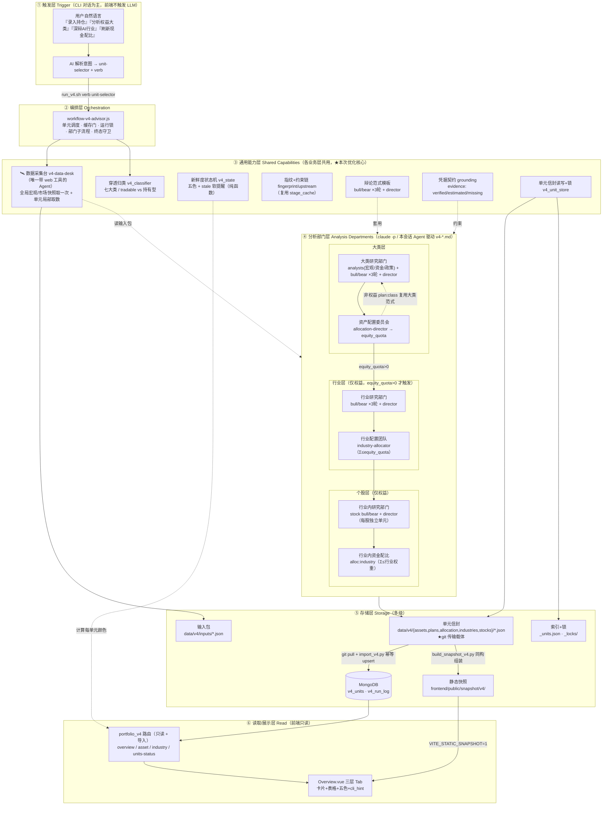
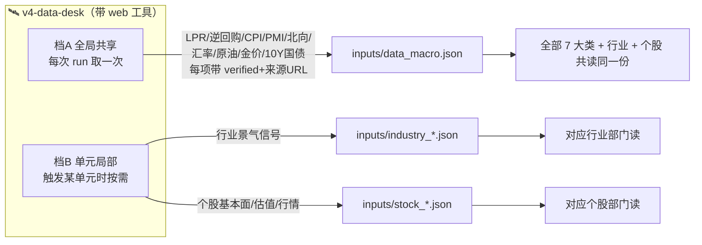
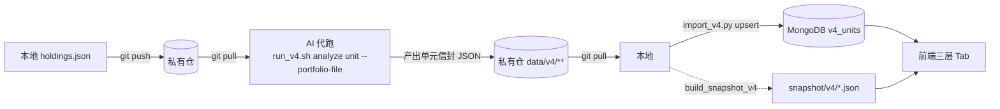
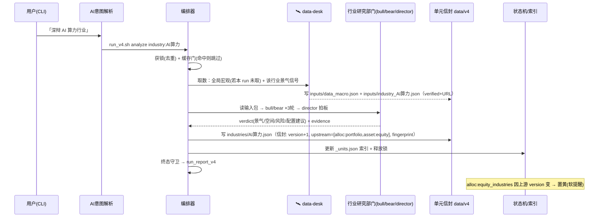

# v4 产品架构图 — 分层独立深度投研系统

> 本文是 v4 的**规范架构图（唯一真源）**。它在 `.kiro/specs/v4/design.md`（需求追溯 + 详细设计）之上做了一次架构优化：把「取数」与「辩论」彻底分离，抽出一个**通用能力层**被所有分析部门共用，解决了「14 个辩论 Agent 各自重复解读宏观、且只有 Read 工具却被要求联网」的矛盾。借鉴 [TauricResearch/TradingAgents](https://github.com/TauricResearch/TradingAgents) 的 Analyst-toolkit / Researcher-debate 分层。
>
> 设计铁律延续 v3：**LLM 决策只走 `.md` 子 Agent + Workflow 编排，Python 不直接 `llm.invoke()`**；运行态存 MongoDB，git 传输用单元粒度 JSON；重计算只在 CLI/本地触发，前端只读。

---

## 0. 一句话架构

> 一切围绕「**分析单元**」（某大类 / 某行业 / 某个股 / 某配比）展开；每个单元独立触发、独立缓存、独立有新鲜度。**取数集中、辩论只读**：一个共享的「数据采集台」联网取数一次、全局共用；各「分析部门」（多空 3 轮辩论 + 总监拍板）只读输入包做研判；产物以统一信封覆盖式落盘，既是 git 传输载体，又幂等导入 MongoDB 供前端三层 Tab 展示。

---

## 1. 分层总览（6 横层 × 3 纵深）

v4 有 **6 个横向运行层**，其中「业务深度层」内部又按 **3 个纵向下钻层**（大类 → 行业 → 个股）逐级深入。



---

## 2. 六个横层的职责

| 层 | 名称 | 关键组件 | 职责 | 不做什么 |
|----|------|----------|------|----------|
| ① | 触发层 | `run_v4.sh` + AI 意图解析 + `v4-advisor` Skill | 把自然语言（含「录入持仓」）映射成 `verb + unit-selector`，在本地调起 | 前端不触发 LLM；不在 Web 跑长任务 |
| ② | 编排层 | `workflow-v4-advisor.js` | 单元调度、缓存门（命中则跳过）、运行锁、部门子流程编排、终态守卫强制吐 run_report | 不直接 `llm.invoke()`；不连带重跑未命中单元 |
| ③ | **通用能力层** | data-desk / classifier / state / fingerprint / 辩论范式 / 凭据契约 / unit_store | **被所有业务层共用的横切能力**（见 §3） | 不含业务研判逻辑 |
| ④ | 分析部门层 | `agents/advisor/v4-*.md` | 三纵深的多空 3 轮辩论 + 总监拍板，产出研判/配比 | **只 Read 输入包，不自己取数**（取数交 data-desk） |
| ⑤ | 存储层 | `data/v4/**` + MongoDB + 快照 | 输入包 / 单元信封（git 载体）/ 索引锁 / 运行态库 / 静态快照 五级（见 §4） | 不存二进制/dump 进 git |
| ⑥ | 读取/展示层 | `portfolio_v4.py` + `Overview.vue` | 三层 Tab 只读展示 + 五色状态 + cli_hint；API 或快照双来源同构 | 无「点即跑 LLM」按钮 |

---

## 3. 通用能力层 —— 哪些能力被各层共用（★本次优化重点）

这是相对原 `design.md` 最重要的结构升级：把散落在 14 个辩论 Agent 里的「取数 + 横切逻辑」抽成 **7 个共享能力**，每个业务部门只负责自己的研判。

| # | 共享能力 | 形态 | 被谁调用 | 解决的重复/矛盾 |
|---|----------|------|----------|------------------|
| 1 | **🛰 数据采集台 `v4-data-desk`** | Agent（**唯一带 `web_search`/`web_fetch` 工具**） | 大类/行业/个股**所有层** | 原本 14 个辩论 Agent 各自解读宏观、且只有 Read 工具却被要求联网（空头支票）。现在取数集中到这一个 Agent |
| 2 | 穿透归类 `v4_classifier` | 纯 Python | 编排层（每次 run 起手） | 七大类归类逻辑只有一份，本地/代跑一致 |
| 3 | 新鲜度状态机 `v4_state` | 纯 Python（只读） | 读取层（每个单元）、编排层（缓存门） | 五色 + stale 判定只有一份口径 |
| 4 | 指纹 + 约束链 `fingerprint/upstream` | 纯 Python（复用 `stage_cache`） | 写单元时、状态机判 stale 时 | 一致性靠「同源指纹」保证，不靠各 Agent 自觉 |
| 5 | 辩论范式模板（bull/bear ×3轮 + director） | Prompt 范式 + 编排循环 | 大类 / 行业 / 个股 / 非权益方案 | 部门结构复用，不为每层重写流程 |
| 6 | 凭据契约 grounding | Prompt 契约 | 每个 analyst/researcher Agent | evidence 统一标 verified/estimated/missing，杜绝编造 |
| 7 | 单元信封读写 + 锁 `v4_unit_store` | 纯 Python | 每次写单元、防并发 | 信封 schema / upsert / 锁只有一份实现 |

### 3.1 数据采集台的两档取数（消除重复 + 保证一致）



- **档 A（run 级，全局）**：宏观/市场快照只取一次，写 `data_macro.json`。7 大类、所有行业、所有个股**共读这一份**——天然消除 N 倍重复抓取，且约束链一致性靠「同源同指纹」由构造保证，而非事后校验。
- **档 B（单元级，局部）**：触发某行业/个股时，才取该单元专属数据（景气信号 / 基本面）。
- **不许降级**：`akshare`/Mongo 在 Pod 缺失时，data-desk 联网兜底，取到的数标 `verified` + 来源 URL；取不到才标 `missing` 并显式提示，**严禁编造或套用示例数字**。
- **辩论 Agent 维持 Read-only**：14 个 `v4-*.md` 不开 web 工具，只消费 data-desk 的输入包——职责清晰、互不重复。

### 3.2 部门内部职责切分（借鉴 TradingAgents Analyst/Researcher 分层）

```
data-desk（取数）
   └─→ 分析师 analysts（宏观/资金/政策视角）──产出单维 report──┐
                                                              ├─→ 总监 director 拍板 → verdict
   └─→ 研究员 bull / bear（多空辩论 ×3轮，回应对方上一轮）────┘
```

- **分析师**：把 data-desk 的原始包消化成单维度 report（宏观面/资金面/政策面）。
- **研究员（多空）**：基于分析师 report + 输入包做 3 轮对立辩论，每轮须正面回应对方上一轮论点。
- **总监**：读 3 轮辩论 + 分析师报告，拍板出 `verdict`（形势/方向/风险/趋势/配比）。
- 这条切分让「取数 → 单维消化 → 多空博弈 → 拍板」各司其职，避免 bull/bear 重复解读原始数据。

---

## 4. 存储层 —— 五级存储各管什么

| 级 | 位置 | 内容 | 角色 | git? |
|----|------|------|------|------|
| 1 输入包 | `data/v4/inputs/*.json` | data-desk/collect 产物：持仓穿透归类、宏观快照、景气、个股基本面 | 部门 Agent 的**只读输入** | 排除（中间产物） |
| 2 **单元信封** | `data/v4/{assets,plans,allocation,industries,stocks}/*.json` | 每单元一个稳定路径 JSON（统一信封 + 差异化 payload） | **运行产物 + git 传输载体**（diff 友好、可 review） | ✅ 解除忽略 |
| 3 索引+锁 | `data/v4/_units.json` · `_locks/*.lock` | 单元状态索引、运行锁（去重/防并发） | 调度元数据 | 索引✅ / 锁排除 |
| 4 运行态库 | MongoDB `v4_units`（主键 `user_id+unit_id`）· `v4_run_log` | 信封幂等 upsert 落地，供 API 查询 | **前端读取源** | — |
| 5 静态快照 | `frontend/public/snapshot/v4/*.json` | 与 API 同构的 overview/详情 | **无后端降级展示** | 私有仓库才推 |

**双跑闭环**：本地编辑 `holdings.json` → push → AI 代跑产出**第 2 级单元信封** → push → 本地 `git pull` → `import_v4.py` 幂等 upsert 到**第 4 级 Mongo** → 前端三层 Tab 与代跑一致。无 Mongo 时设 `VITE_STATIC_SNAPSHOT=1` 直读**第 5 级快照**。



---

## 5. 业务三纵深与单元约束链

```mermaid
flowchart TD
    M["🛰 data-desk 全局宏观快照（run 级取一次）"] --> A

    subgraph 大类层
        A["asset:&lt;class&gt; ×7<br/>大类研究部门"] --> P["alloc:portfolio<br/>配置委员会 → equity_quota"]
    end
    subgraph 行业层（仅权益）
        I["industry:&lt;name&gt; ×N<br/>行业研究部门"] --> EA["alloc:equity_industries<br/>Σ权重 ≤ equity_quota"]
    end
    subgraph 个股层（仅权益）
        S["stock:&lt;code&gt; ×M<br/>行业内研究部门"] --> IA["alloc:industry:&lt;name&gt;<br/>Σ权重 ≤ 行业权重"]
    end
    P -->|equity_quota>0| I
    EA --> S
    P -.->|非权益 plan:&lt;class&gt; ×6| A

    classDef alloc fill:#fde,stroke:#c69;
    class P,EA,IA alloc;
```

- **约束硬下传**：`equity_quota`（权益目标配比）从 `alloc:portfolio` 下传为行业层权重上限；行业权重再下传为个股配比上限。
- **stale 软上传**：任一上游 version 递增 → 下游经 `upstream` 指纹比对置黄（建议刷新），**绝不自动重跑、不修正数值**（FR-005）。
- **单元独立**：每个 `asset/industry/stock/alloc` 都是可独立触发、独立缓存、独立五色状态的原子；零持仓大类也能分析（择机配置）。

---

## 6. 一次单元分析的完整数据流（以「深辩 AI 算力行业」为例）



---

## 7. 相对原 design.md 的优化点（变更说明）

| 优化 | 原 `design.md` | 本架构图 |
|------|----------------|----------|
| **取数/辩论分离** | 取数散在 collect_v4 + 各 Agent prompt「自行联网补齐」 | 抽出**通用能力层**，新增 `v4-data-desk`（唯一带 web 工具），取数集中、辩论只读 |
| **宏观一致性** | 每个大类 Agent 各自解读宏观，靠事后校验对齐 | 全局宏观快照 run 级取一次、全单元同源共读，一致性由构造保证 |
| **联网矛盾** | Agent 只有 Read 工具却被要求 web 取数（做不到） | 联网集中在 data-desk；14 个辩论 Agent 维持 Read-only |
| **部门内职责** | bull/bear 与 analysts 都读原始数据，职责重叠 | 借鉴 TradingAgents：analysts 消化单维 report → bull/bear 基于 report 辩论 → director 拍板 |
| **降级策略** | 缺数据源即降级标 missing | data-desk 联网兜底，取到标 verified+URL，取不到才 missing 并显式提示 |

> 落地代价：新增 1 个 `v4-data-desk.md` Agent + 编排器在 run 开头插「data-desk 先跑一次」阶段；`collect_v4.py` 退回到「持仓归类 + 拼包骨架」，web 取数交给 data-desk。**14 个辩论 Agent 一行不改。**

---

## 8. 关联文档

| 文档 | 内容 |
|------|------|
| `.kiro/specs/v4/design.md` | 需求追溯（9 FR×AC → 设计）+ 单元信封/状态机/payload schema 详细设计 |
| `.kiro/specs/v4/requirements.md` | EARS 需求（FR-001~009 / NFR-001~005） |
| `planning/v4/full-analysis-plan.md` | 全量分析计划（Wave 分解、逐单元验证） |
| `docs/wiki/v4-ai-proxy-run.md` | AI 代跑具体步骤 + 各单元 payload 速查 |
| `data/v4/_inputs/README.md` | holdings.json 格式与七大类归类规则 |
| `.claude/skills/v4-advisor/SKILL.md` | 自然语言 → unit-selector 触发映射（含持仓录入） |
