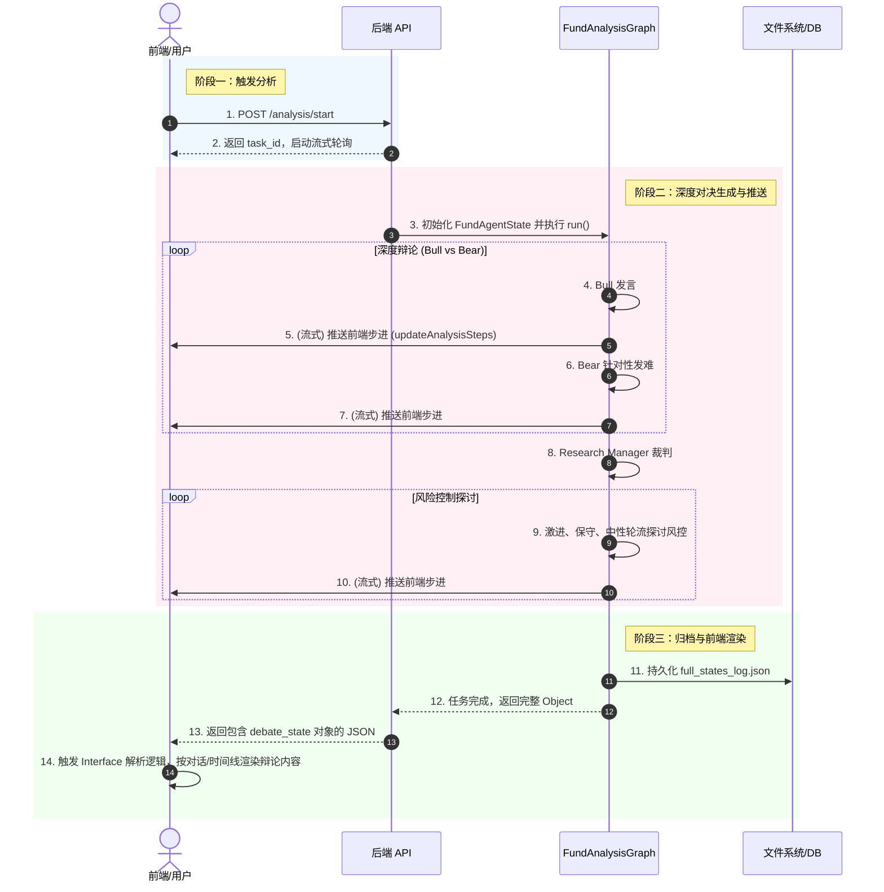

## O — Objective（业务目标）

- **(P) 现状**：目前基金分析 (`fund_graph.py`) 的引擎为单向串行流水线，完全缺失原版股票系统中的“多空双派（Bull vs Bear）对抗式辩论”与“三方风控辩论（Aggressive/Neutral/Conservative）”机制。同时前端在渲染对象类型的辩论状态时呈现为丑陋的 JSON 字符串。
- **(A) 动作**：重构 `fund_graph.py` 及对应的 Agent 集合，复刻原版股票的 `ConditionalLogic` 辩论图模型。引入 `Fund Bull Researcher` 与带有基金专有挑刺视角的 `Fund Bear Researcher`。前端改造报告渲染逻辑，支持对话体/时间线展示辩论过程。
- **(M) 指标**：
  - 单只基金分析过程需包含至少 2 轮 Bull vs Bear 辩论及 1 轮三方风控探讨。
  - 前端支持原生渲染至少两组辩论状态对象，而非纯 JSON stringify。

---

## A — Architecture（领域模型与业务流）

### A.1 模块与实体总览

所属模块：后端 Agent 引擎 / 前端报告渲染 / 基金分析执行图

| 实体名称 | 核心属性（简述） | 生命周期起点 | 生命周期终点 | 依赖的上游实体 |
|---------|---------------|-----------|-----------|-------------|
| FundAgentState | 保存图执行的流转状态，包含对话历史与各角色报告 | `run()` 被调用时初始化 | `FundTrader` 节点执行完毕时 | 无 |
| DebateNode | 执行大模型提示的计算节点 | `ConditionalLogic` 路由时激活 | 输出节点对话内容回填至 State 时 | FundAgentState 的中间报告 |
| FundAnalysisReport| 供前端渲染的报告载体及落盘产物 | 任务结束后由后端生成 | 前端切换标的或清理缓存时 | FundAgentState |

### A.2 领域实体定义

#### 实体 1：FundAgentState

| 属性项 | 定义内容 | 备注说明 |
|--------|---------|---------|
| 实体名称 | 基金智能体状态 | 贯穿 LangGraph 的核心数据总线 |
| 实体编码 | FundAgentState | 定义在 TypedDict 中 |
| 唯一标识 | `run_id` | 一次分析请求的全局唯一 ID |
| 业务描述 | 承载基础分析报告、辩论轮数计数、历史发言记录及最终决策的上下文 |

**核心属性定义**

| 字段名称 | 字段编码 | 数据类型 | 必填 | 业务规则与约束 |
|---------|---------|---------|------|-------------|
| 基础报告合集 | `fund_manager_report`, `fund_holdings_report`, `fund_risk_report` | String | 是 | 由第一阶段单向分析师生成 |
| 投资辩论状态 | `investment_debate_state` | Dict | 是 | 必须包含 `bull_history`, `bear_history`, `history`, `count` 等控制循环的键 |
| 风控辩论状态 | `risk_debate_state` | Dict | 是 | 必须包含 `aggressive_history`, `neutral_history`, `conservative_history`, `history` 及 `count` |

**状态转移表（Fund Analysis Graph Flow）**

| 当前状态 | 触发事件/动作 | 前置校验条件（Guard） | 目标状态 | 后置动作/副作用 |
|---------|-------------|-------------------|---------|-------------|
| `START` | 图启动 | 无 | `Fund Manager Analyst` | 无 |
| `Fund Manager Analyst` | 节点完成 | 包含工具调用？是 | `tools_manager` | 无 |
| `Fund Manager Analyst` | 节点完成 | 包含工具调用？否 | `Fund Holdings Analyst` | 写入经理分析报告 |
| `Fund Holdings Analyst` | 节点完成 | 同上判定 | `Fund Risk Analyst` | 写入持仓分析报告 |
| `Fund Risk Analyst` | 节点完成 | 同上判定 | `Fund Bull Researcher` | 写入基础风险报告，结束 Tier 1 单向环节 |
| `Fund Bull Researcher` | 节点完成 | `debate_state.count < max` | `Fund Bear Researcher` | 追加多头观点到 history |
| `Fund Bear Researcher` | 节点完成 | `debate_state.count < max` | `Fund Bull Researcher` | 追加空头观点到 history，附带逆向思维攻击 |
| `Fund Bull/Bear Researcher` | 节点完成 | `debate_state.count >= max` | `Fund Research Manager` | 结束循环，流转给主管裁判 |
| `Fund Research Manager` | 节点完成 | 无 | `Fund Aggressive Analyst` | 输出中期决策 |
| `Fund Aggressive Analyst`| 节点完成 | 风险探讨未达上限 | `Fund Conservative Analyst` | 三方辩论流转 |
| `Fund Conservative Analyst`| 节点完成 | 风险探讨未达上限 | `Fund Neutral Analyst` | 三方辩论流转 |
| `Fund Neutral Analyst` | 节点完成 | 风险探讨未达上限 | `Fund Aggressive Analyst` | 循环探讨 |
| `* Analyst` (风险) | 节点完成 | 探讨到达上限 | `Fund Trader (Portfolio PM)`| 流转至最终决断 |
| `Fund Trader` | 节点完成 | 无 | `END` | 落盘 JSON、Markdown，返回给前端 |

### A.3 核心数据流与交互

### A.4 核心规则与算法

**规则 1：空头分析师 (Fund Bear) 强制视角**
必须在 Prompt 中要求其提取 `fund_holdings_report` (评估十大重仓集中度)、`fund_manager_report` (评估换手率/回撤/一拖多)，进行非通用化的基金特有攻击。

---

## I — Interface（人机交互层）

### 页面：单股分析页 (SingleAnalysis.vue 改造)

- **交互端**：Web 前端
- **数据源**：FundAnalysisReport 的后端返回结果 `analysisResults.value.state` 或 `.reports`
- **页面结构**：
  - **分析进度条 (现存)**：无缝接收 `step_current`，展示多头/空头/裁判思考的过程。
  - **详细分析报告 Tab 区 (改造区)**：
    - **新增映射**：在 `reportMappings` 中增加针对基金或通用辩论的 Mapping（如 `investment_debate_state: '⚔️ 投资多空辩论'`, `risk_debate_state: '🛡️ 风险控制辩论'`）。
    - **视图增强 (Chat/Timeline View)**：当 `formatReportContent` 遇到参数为对象类型（Object）且具有 `history`（长字符串通过 `\n` 或其他分隔符拼接）或 `bull_history` 时，放弃使用原先粗暴的 `JSON.stringify` 机制。
    - **结构化提取**：前端需要把 `history` 切分为一个个发言块（可正则匹配 `Bull Analyst:`, `Bear Analyst:`, `Aggressive Analyst:` 等开头），并循环渲染成美观的“对话气泡”或“卡片组”，内部仍然支持 Marked 渲染。

- **校验规则**：

| 校验项 | 校验逻辑 | 报错提示 |
|--------|---------|---------|
| 辩论对象解析 | 判断数据是否为对象且包含 `history`，若不满足走原 stringify | / (静默降级) |

---

## S — Scenarios（边界与异常场景）

| 场景编号 | 场景类型（SECURE） | 场景描述 | 前置条件 | 预期系统行为（前端提示 & 后端处理） |
|---------|------------------|---------|---------|-------------------------------|
| SCN-E-01 | Error | 基金属于特殊类（如纯债或货币基金），无有效重仓股 | `fund_holdings_report` 数据为空或获取异常 | 后端：Bear 的 Prompt 能识别缺乏持仓数据并转向攻击流动性或收益上限；前端：正常渲染辩论流。 |
| SCN-E-02 | Error | 辩论节点（如 Bull/Bear）请求 LLM API 超时中断 | 某次大模型生成由于网络原因失败 | 后端：Catch 异常并记录已有的历史内容，直接流转给 Trader 节点兜底；前端：渲染半截的 `history`，并在界面不崩溃的前提下显示。 |
| SCN-E-03 | Edge | 后端返回的数据 `investment_debate_state` 格式变更，没有 `history` 字段 | 后端字典结构偶发变更 | 前端：解析失败时触发 `formatReportContent` 的 try-catch 兜底，优雅降级为 Markdown 的 JSON.stringify 块渲染。 |
| SCN-U-01 | Undo | 用户点击重新分析 | - | 前端：清空当前状态与本地持久化缓存并重新发起，后端的 Graph 完全新建 StateGraph 实例执行。 |

---
*自检通过：状态机无孤立，数据流匹配，实体映射清晰，场景完备。*