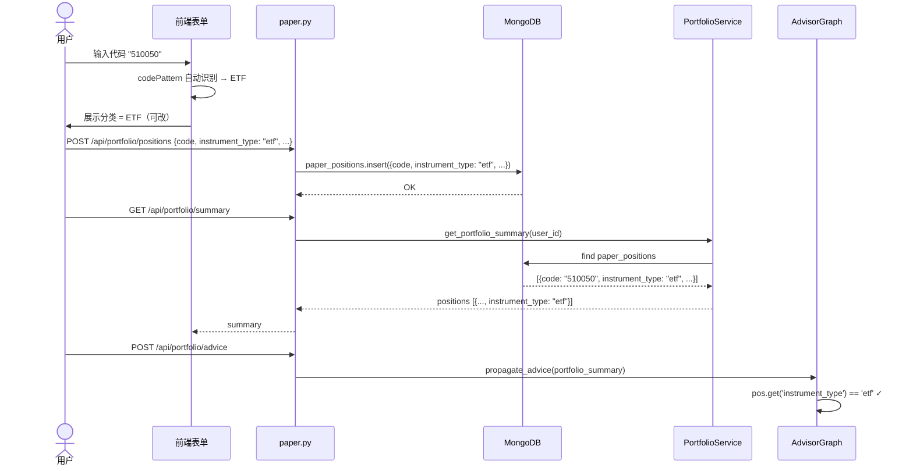

# instrument_type 标的分类 — PRD

**日期**: 2026-05-18
**复杂度**: L2 标准

---

## O — 概述

### P.A.M 三段论

- **Problem**: 当前持仓系统只能标记市场（CN/HK/US），无法区分标的类型。用户添加基金/ETF/债券时，Tier 2 引擎仍按"股票"对其进行分析，给出错误的操作建议。
- **Approach**: 在持仓全链路（前端 → API → MongoDB → PortfolioService → 引擎）贯通 `instrument_type` 字段，支持 5 种分类，根据股票代码自动识别 + 可手动修改。
- **Metrics**: 
  - 前端添加/编辑表单 100% 展示分类选择器
  - PortfolioService `get_portfolio_summary()` 返回 `instrument_type`
  - Tier 2 引擎不再退化到 `'stock'` 默认值

---

## A — 分析

### 实体状态机

```
Position 状态:
  created → (编辑) → updated
         → (删除) → deleted

instrument_type 状态:
  输入代码 → 自动识别 → 展示默认值 → (用户修改) → 确认 → 存储
```

### Mermaid 时序图



---

## I — 接口

### 页面-实体绑定

| 页面 | 实体 | 操作 |
|------|------|------|
| 我的持仓 `/portfolio` — 持仓表格 | Position | 查看 instrument_type 列 |
| 我的持仓 — 添加持仓弹窗 | Position | 代码输入 → 自动识别 → 可选手动修改 |
| 我的持仓 — 编辑持仓弹窗 | Position | 可修改 instrument_type |

### 前端改动

1. `frontend/src/views/PaperTrading/index.vue`:
   - 持仓表格：新增 `instrument_type` 列，用不同 tag 颜色区分
   - 添加/编辑弹窗：新增 `instrument_type` 下拉选择器
   - 输入代码时自动识别类型

2. `frontend/src/api/paper.ts`:
   - `PortfolioPositionItem` / `PortfolioSummaryPosition` 新增 `instrument_type: string`
   - `AddPositionPayload` / `UpdatePositionPayload` 新增 `instrument_type: string`

### 后端改动

1. `app/routers/paper.py`:
   - `AddPositionRequest`: 新增 `instrument_type: Optional[str]`
   - `UpdatePositionRequest`: 新增 `instrument_type: Optional[str]`
   - `add_position()`: 存储 instrument_type
   - `update_position()`: 更新 instrument_type
   - 新增 `_detect_instrument_type(code, market)` 辅助函数

2. `app/services/portfolio_service.py`:
   - `get_portfolio_summary()`: 返回 `instrument_type`

---

## S — 场景

### SECURE 六类场景

#### Success
- 用户输入 `510050` → 自动识别为 ETF → 添加成功 → 表格显示 ETF 标签
- 用户输入 `600519` → 自动识别为股票 → 手动改为"基金" → 保存后引擎按基金处理
- 用户编辑已有持仓 → 修改分类 → 保存后刷新生效

#### Edge
- 港股代码 `0700` → 自动识别为股票（港股无 ETF 前缀规则）
- 美股代码 `SPY` → 不做自动识别，默认股票 → 用户可手动改
- 已存在的旧持仓 → instrument_type 为 null → 前端显示"未分类"→ 用户可编辑补充

#### Constraint
- instrument_type 只能从 `stock/etf/fund/bond/other` 中选取
- Tier 2 引擎中 `pos.get('instrument_type', 'stock')` 不再退化——PortfolioService 保证返回该字段

#### Unhappy
- 代码识别失败 → 默认 `stock` → 用户手动修正
- 后端未收到 instrument_type → 回退为 `stock`（保留现有行为）

#### Risk
- 无破坏性变更：所有旧数据兼容，instrument_type 为 null 时降级为 `stock`
- 前端 TypeScript 类型需同步后端变更

#### Edge-case
- 可转债（如 `1130xx`）→ 用户可手动选 `bond` 或 `other`
- REITs（如 `5080xx`）→ 用户可手动选 `other`

---

## 自检矩阵

| 检查项 | 状态 |
|--------|------|
| P 有数据 | ✓ Metrics 可验证 |
| M 有数字 | ✓ 状态转移表完备 |
| 状态转移无孤立 | ✓ 2 态 + null 兼容 |
| SECURE 六类各 ≥1 | ✓ 见上方 |
| PRD 引用原型 | N/A — 无新页面/新布局 |
