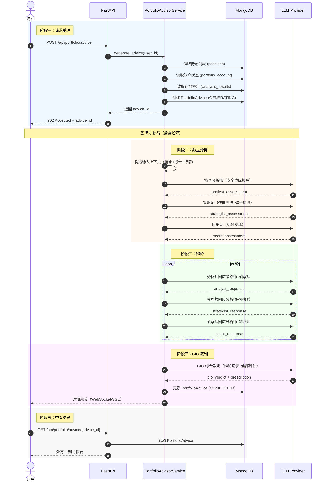

# 组合顾问引擎（Tier 2）PRD

## O — Objective（业务目标）

- **(P) 现状**：用户通过 TG-CN 对单只股票跑深度分析（4 分析师 + 辩论），每次 3-5 分钟，报告存档在 MongoDB。但用户持有 5-15 只标的（股票/基金/黄金），系统无法给出"我的持仓整体该怎么操作"的组合级建议。用户需要自己逐一翻报告、人脑综合判断。
- **(A) 动作**：构建 Tier 2 组合顾问引擎——读取用户全部持仓 + 存档分析报告 + 最新行情，通过 3 角色独立分析 + 辩论 + 裁判，输出组合级操作建议（每只持仓的操作 + 新建仓推荐 + 风险提示）。不修改现有 Tier 1 分析引擎。
- **(M) 指标**：
  - 组合建议生成时间 ≤ 60s（10 只持仓规模）
  - 每条操作建议附带理由和辩论依据
  - 用户可在 2 次点击内看到完整操作方案

## A — Architecture（领域模型与业务流）

### A.1 模块与实体总览

所属模块：组合顾问引擎（portfolio-advisor-engine）

| 实体名称 | 核心属性 | 生命周期起点 | 生命周期终点 | 依赖的上游实体 |
|---------|---------|-----------|-----------|-------------|
| PortfolioAdvice | user_id, 处方摘要, 辩论记录, 生成时间 | 用户触发组合分析 | 归档（新报告生成时旧报告归档） | Position, AnalysisResult |
| AdviceItem | 标的代码, 操作类型, 幅度, 理由 | 随 PortfolioAdvice 创建 | 随 PortfolioAdvice 归档 | PortfolioAdvice |
| DebateRecord | 角色, 轮次, 发言内容 | 辩论开始 | 辩论结束（嵌入 PortfolioAdvice） | PortfolioAdvice |

关联的上游实体（已在 portfolio-advisor 变更中定义）：

| 实体 | 来源 | 用途 |
|------|------|------|
| Position | portfolio CRUD | 用户持仓列表 |
| PortfolioAccount | portfolio CRUD | 账户状态（总投入/可用现金） |
| AnalysisResult | Tier 1 分析引擎 | 存档的深度分析报告 |

### A.2 领域实体定义

#### 实体：PortfolioAdvice（组合建议报告）

| 属性项 | 定义内容 |
|--------|---------|
| 实体名称 | 组合建议报告 |
| 实体编码 | PortfolioAdvice |
| 唯一标识 | advice_id (MongoDB ObjectId) |
| 业务描述 | 组合顾问对用户全部持仓的综合操作建议，含处方（操作列表）和病历（辩论过程） |

**核心属性定义**

| 字段名称 | 字段编码 | 数据类型 | 必填 | 业务规则与约束 |
|---------|---------|---------|------|-------------|
| 用户ID | user_id | String | 是 | 关联 portfolio 账户 |
| 状态 | status | Enum | 是 | GENERATING / COMPLETED / FAILED |
| 处方摘要 | prescription | List[AdviceItem] | 是 | 3-15 条操作建议 |
| 组合概况 | portfolio_snapshot | Object | 是 | 生成时的持仓快照（总资产/仓位分布/盈亏） |
| 辩论记录 | debate_records | List[DebateRecord] | 是 | 完整辩论过程 |
| CIO裁定 | cio_verdict | String | 是 | 最终裁定原文 |
| 报告引用 | referenced_reports | List[Object] | 是 | 引用的 Tier 1 报告 ID + 生成时间 |
| 过期报告标记 | stale_reports | List[Object] | 否 | 报告超过阈值的标的列表 |
| 生成耗时 | duration_seconds | Float | 是 | 引擎执行时间 |
| 创建时间 | created_at | DateTime | 是 | 自动生成 |

**状态机**

状态字典：

| 状态名称 | 状态枚举值 | 业务含义 |
|---------|----------|---------|
| 生成中 | GENERATING | 引擎正在执行（独立分析 → 辩论 → 裁判） |
| 已完成 | COMPLETED | 建议生成成功，可展示给用户 |
| 失败 | FAILED | 生成过程出错（LLM 失败/数据不可用） |

状态转移表：

| 当前状态 | 触发事件 | 前置校验 | 目标状态 | 后置动作 |
|---------|---------|---------|---------|---------|
| (初始) | 用户触发组合分析 | 用户有至少 1 只持仓 | GENERATING | 旧报告标记为归档；启动引擎管线 |
| GENERATING | 引擎执行完成 | 无 | COMPLETED | 存储报告；通知前端 |
| GENERATING | 引擎执行出错 | 无 | FAILED | 记录错误信息；通知前端 |

#### 实体：AdviceItem（操作建议条目）

| 属性项 | 定义内容 |
|--------|---------|
| 实体名称 | 操作建议条目 |
| 实体编码 | AdviceItem |
| 唯一标识 | 无独立 ID，嵌入 PortfolioAdvice |
| 业务描述 | 对单只标的的操作建议，是"处方"的一行 |

**核心属性定义**

| 字段名称 | 字段编码 | 数据类型 | 必填 | 业务规则与约束 |
|---------|---------|---------|------|-------------|
| 标的代码 | code | String | 是 | 股票/基金/黄金代码 |
| 标的类型 | instrument_type | Enum | 是 | stock / fund / etf / gold / bond |
| 操作类型 | action | Enum | 是 | BUY / ADD / REDUCE / SELL / HOLD / WATCH |
| 操作幅度 | magnitude | String | 否 | "加仓10%"/"减至500股"，自然语言描述 |
| 理由 | reasoning | String | 是 | 一句话核心逻辑 |
| 来源 | source | Enum | 是 | ANALYST / STRATEGIST / SCOUT / CIO |
| 是否新建仓 | is_new_position | Boolean | 是 | true=侦察兵推荐的新标的 |
| 引用报告 | report_id | String | 否 | 关联的 Tier 1 分析报告 ID |
| 报告是否过期 | report_stale | Boolean | 否 | 报告超过 7 天标记为过期 |

action 枚举说明：

| 枚举值 | 含义 |
|--------|------|
| BUY | 新建仓（侦察兵推荐的新标的） |
| ADD | 现有持仓加仓 |
| REDUCE | 现有持仓减仓 |
| SELL | 清仓/止损 |
| HOLD | 维持不动 |
| WATCH | 观望，暂不操作但需关注 |

#### 实体：DebateRecord（辩论记录）

嵌入 PortfolioAdvice，无独立生命周期。

| 字段名称 | 字段编码 | 数据类型 | 必填 | 说明 |
|---------|---------|---------|------|------|
| 角色 | role | Enum | 是 | ANALYST / STRATEGIST / SCOUT |
| 轮次 | round | Int | 是 | 第几轮发言 |
| 发言内容 | content | String | 是 | 完整发言 |
| 时间戳 | timestamp | DateTime | 是 | 发言时间 |

### A.3 核心数据流与交互

**触发源**：用户在"我的持仓"页面点击"组合建议"按钮。



**节点执行详情**

**阶段二：独立分析**（三个角色并行或顺序执行，各自看不同数据）

| 角色 | 输入数据 | 分析维度 | 输出 |
|------|---------|---------|------|
| 持仓分析师 | 每只持仓的 Tier 1 报告 + 当前价格 + 持仓成本 | 逐只评估：报告结论 vs 当前价格 vs 安全边际 | 每只持仓的操作评估 |
| 策略师 | 组合整体仓位分布 + 行业集中度 + 相关性 | 组合构建缺陷：集中度、行业偏移、认知偏差 | 组合级修正建议 |
| 侦察兵 | 策略师发现的组合缺口 + 历史分析过但未持有的报告 + 行业趋势数据 | 机会发现：填补缺口、捕捉趋势 | 新建仓候选列表 |

**阶段三：辩论**

三角色轮转辩论，每轮各发言一次。默认 2 轮（共 6 次发言），可配置。每次发言可看到其他两位的最新发言 + 历史辩论记录。

**阶段四：CIO 裁判**

输入：三角色的独立分析 + 完整辩论记录 + 持仓全景。
输出：结构化的 AdviceItem 列表（处方）+ 裁定理由。
思维约束：集中持仓（不过度分散）、长期思维（不因短期波动改变判断）。

### A.4 核心规则与算法

**规则 1：报告时效性判断**

```
IF report.created_at < now() - 7 days:
    report_stale = True
    在 AdviceItem 中标注"报告已过期，建议重新分析"
ELSE:
    report_stale = False
    正常引用报告结论
```

阈值 7 天为默认值，可在系统配置中调整。

**规则 2：侦察兵候选源**

侦察兵从以下来源发现新标的（优先级递减）：

1. 用户之前分析过但未持有的股票（analysis_results 中有报告，positions 中无持仓），且报告评级为 Buy/Overweight
2. 策略师识别的组合缺口方向（如"缺新能源敞口"），从 AKShare 行业板块数据中筛选
3. 市场热度信号（雪球热门、东财资金流向）中符合组合缺口方向的标的

侦察兵只做筛选和推荐，不做深度分析。如需深度分析，在 AdviceItem 中标注"建议先跑深度分析"。

**规则 3：CIO 裁判约束**

CIO prompt 中硬编码以下思维约束：

- **逆向验证**：对每条"加仓/建仓"建议，必须回答"如果判断错误，最大亏损是多少？"
- **认知偏差检查**：是否存在禀赋效应（因持有而高估）、近因偏差（因近期涨跌影响判断）、锚定效应（锚定买入成本而非内在价值）
- **集中度红线**：单只标的仓位建议不超过 30%，单一行业不超过 50%（可配置）
- **操作幅度约束**：单次调仓建议幅度不超过总资产 15%，避免大幅波动

**算法 1：持仓分析师 — 安全边际计算**

```
对每只持仓:
    current_price = 最新行情价格
    report_rating = Tier 1 报告的评级 (Buy/Hold/Sell 等)
    report_target = Tier 1 报告中的目标价（如有）
    avg_cost = 用户买入均价
    position_weight = 该持仓市值 / 总资产

    margin_of_safety = (report_target - current_price) / current_price  # 如有目标价
    unrealized_pnl = (current_price - avg_cost) / avg_cost

    评估 = {
        code, instrument_type,
        report_rating, report_stale,
        current_price, avg_cost,
        margin_of_safety, unrealized_pnl,
        position_weight,
        assessment: "基于以上数据的一段话评估"
    }
```

## I — Interface（人机交互层）

### 页面：组合建议面板（嵌入"我的持仓"页面）

- **交互端**：Web
- **数据源**：PortfolioAdvice 实体，通过 GET /api/portfolio/advice/latest 获取
- **入口**：持仓页面顶部"组合建议"按钮
- **页面结构**：
  - **触发区**：`el-button`"获取组合建议"→ 调用 POST /api/portfolio/advice → 显示加载状态
  - **处方区**（`el-drawer` 或页面内折叠）：
    - 顶部：组合概况卡片（总资产/持仓数/最后分析时间）
    - 主体：AdviceItem 表格
      - 列：标的代码 | 标的类型图标 | 操作（色彩标记：红=买入/加仓，绿=卖出/减仓，灰=观望） | 幅度 | 理由
      - 新建仓条目用特殊样式标注
      - 过期报告条目用 ⚠️ 标注
    - 底部：风险提示区（集中度/过期报告警告）
  - **病历区**（默认折叠）：
    - `el-collapse` 展开辩论记录
    - 按角色分 Tab：分析师 / 策略师 / 侦察兵 / CIO 裁定
  - **历史区**：
    - 下拉选择历史建议报告（按日期）
- **权限控制**：仅当前用户可见自己的组合建议
- **校验规则**：

| 校验项 | 校验逻辑 | 报错提示 |
|--------|---------|---------|
| 持仓为空 | positions.length == 0 | "请先录入持仓后再获取组合建议" |
| 生成中 | 已有 GENERATING 状态的报告 | "组合建议正在生成中，请稍候" |

## S — Scenarios（边界与异常场景）

| 场景编号 | 类型 | 场景描述 | 前置条件 | 预期系统行为 |
|---------|------|---------|---------|-------------|
| SCN-S-01 | Security | 用户 A 尝试查看用户 B 的组合建议 | A 携带自己的 JWT 访问 B 的 advice_id | 后端校验 user_id 不匹配，返回 403；前端不展示 |
| SCN-E-01 | Error | LLM 调用超时或失败 | 辩论阶段某轮 LLM 返回错误 | 重试 1 次；仍失败则 PortfolioAdvice 转为 FAILED，前端提示"生成失败，请重试"，保留已完成的部分分析供参考 |
| SCN-E-02 | Error | 持仓中某只股票获取行情失败 | AKShare/ForeignStockService 返回 None | 该标的行情标记为"不可用"，分析师评估中注明"最新价不可用，基于报告价格评估"，不阻塞整体流程 |
| SCN-C-01 | Concurrency | 用户连续点击两次"获取建议" | 第一次请求还在 GENERATING | 第二次请求返回 409，前端提示"建议正在生成中"，不创建新任务 |
| SCN-U-01 | Undo | 用户对建议不满意想重新生成 | 已有 COMPLETED 的报告 | 允许重新触发，旧报告保留为历史记录，新报告覆盖"最新"标记 |
| SCN-R-01 | Restriction | 全部持仓都没有 Tier 1 分析报告 | 用户录入了持仓但从未跑过分析 | 分析师阶段无报告可读，输出中每只标的标注"无深度分析报告，建议先跑分析"；策略师和侦察兵仍可基于行情和仓位分布给建议 |
| SCN-R-02 | Restriction | 持仓包含非股票品种（基金/黄金） | 用户持有 510300 (ETF) | Tier 1 报告不存在（暂不支持），分析师基于行情和仓位占比评估；侦察兵不推荐同类型替代品 |
| SCN-E-03 | Edge | 用户只有 1 只持仓 | positions.length == 1 | 策略师跳过集中度/相关性分析（无意义），分析师正常评估，侦察兵正常推荐新标的 |
| SCN-E-04 | Edge | 用户持有 30+ 只标的 | 持仓数量超过 20 | 分析师按市值排序，详细评估前 20 只，剩余合并为"其他持仓"汇总处理；CIO 约束中提示"持仓过于分散" |

## 自检矩阵

| 检查项 | 结果 |
|--------|------|
| 状态机完整性 | ✅ GENERATING→COMPLETED/FAILED，无孤立状态 |
| 数据流-状态机一致性 | ✅ 时序图阶段一创建 GENERATING，阶段四更新为 COMPLETED/FAILED |
| 界面-实体绑定 | ✅ 处方区绑定 AdviceItem，病历区绑定 DebateRecord，均在 A.2 定义 |
| 按钮-事件链路 | ✅ "获取建议"→ POST /advice → 状态转移表第 1 行 |
| 场景覆盖度 | ✅ SECURE 六类各有覆盖，核心异常（LLM 失败、行情不可用、无报告）已穷举 |
| O-M 可验证性 | ✅ 生成时间可从 duration_seconds 采集，操作建议条数可统计 |
| 实体关系一致性 | ✅ A.1 总览、A.2 关系、A.3 数据流三处一致 |
