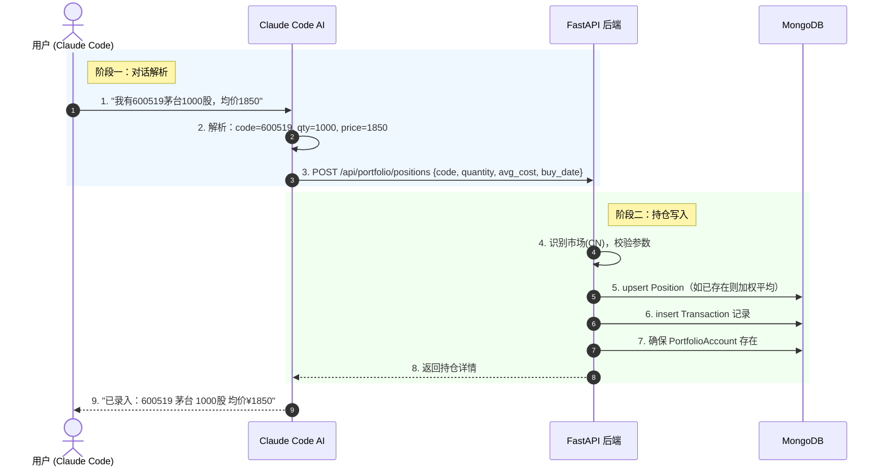
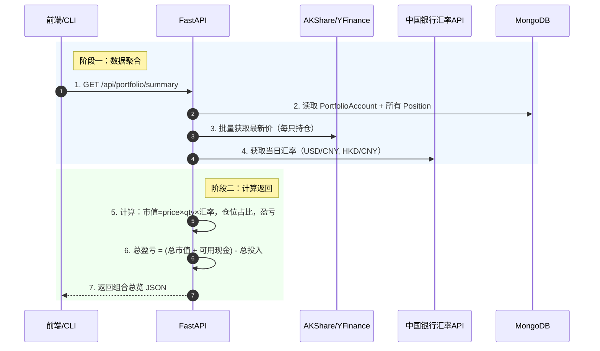
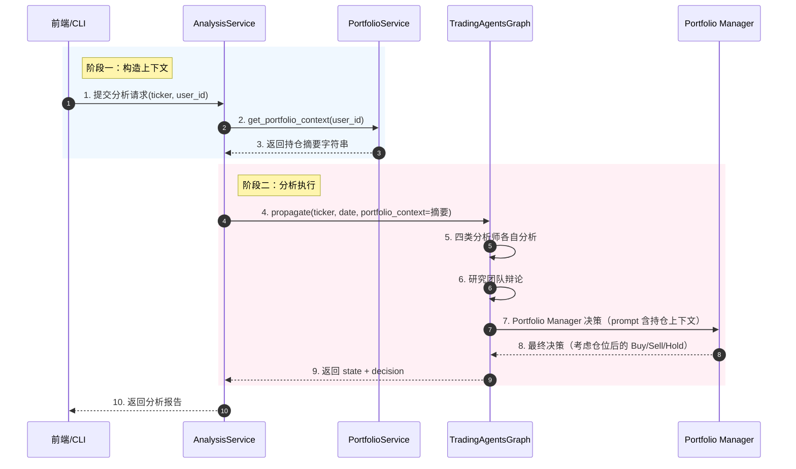

# 个人持仓管理 + 定制化投资建议 — O.A.I.S PRD

## O — Objective（业务目标）

- **(P) 现状**：TG-CN 目前是"一次性分析工具"——用户输入 ticker，跑一轮分析，看完报告就结束。系统不知道用户持有什么、投了多少钱、盈亏如何。分析建议（Buy/Sell/Hold）无法考虑用户的仓位状况（已经重仓的股票继续说 Buy 毫无意义）。用户无法获得组合级投资建议。
- **(A) 动作**：改造现有 PaperTrading 模块为真实持仓管理，通过 CLI 对话录入持仓数据，将用户持仓上下文注入分析引擎，使每次分析都是"知道我有什么"的个性化分析。先做持仓管理 + 上下文注入（Phase 1），后做组合诊断 + 主动发现（Phase 2）。
- **(M) 指标**：
  - 持仓录入 → 行情刷新 → 盈亏计算全链路 ≤ 5 秒
  - 分析报告中出现用户持仓上下文（可验证：Portfolio Manager prompt 包含持仓信息）
  - 总盈亏计算准确：`(持仓市值 + 可用现金) - 总投入 = 总盈亏`

---

## A — Architecture（领域模型与业务流）

### A.1 模块与实体总览

所属模块：持仓管理模块（portfolio）

| 实体名称 | 核心属性 | 生命周期起点 | 生命周期终点 | 依赖的上游实体 |
|---------|---------|-----------|-----------|-------------|
| PortfolioAccount | total_invested, available_cash, currency | 用户首次录入持仓时创建 | 用户重置账户 | 无 |
| Position | code, market, quantity, buy_price, buy_date | CLI 录入创建 | 全部卖出（quantity=0）删除 | PortfolioAccount |
| Transaction | code, side, quantity, price, timestamp | 录入/卖出时创建 | 不可删除（审计记录） | Position |

### A.2 领域实体定义

#### 实体：PortfolioAccount

| 属性项 | 定义内容 | 备注说明 |
|--------|---------|---------|
| 实体名称 | 投资账户 | 用户的统一投资账户 |
| 实体编码 | PortfolioAccount | |
| 唯一标识 | user_id | 一个用户一个账户 |
| 业务描述 | 记录用户的总投入资金和可用现金，统一人民币计价 |

**核心属性定义**

| 字段名称 | 字段编码 | 数据类型 | 必填 | 业务规则与约束 |
|---------|---------|---------|------|-------------|
| 用户ID | user_id | String | 是 | 唯一，关联 auth 系统 |
| 总投入 | total_invested | Float | 是 | 用户累计投入的资金总额（人民币），≥ 0 |
| 可用现金 | available_cash | Float | 是 | 当前可用于买入的资金（人民币），≥ 0 |
| 创建时间 | created_at | DateTime | 是 | 自动生成 |
| 更新时间 | updated_at | DateTime | 是 | 每次操作更新 |

**状态机**

状态字典：

| 状态名称 | 状态枚举值 | 业务含义说明 |
|---------|----------|-----------|
| 活跃 | ACTIVE | 正常使用中 |

状态转移表：

| 当前状态 | 触发事件 | 前置校验条件 | 目标状态 | 后置动作 |
|---------|---------|-----------|---------|---------|
| 无 | 首次录入持仓 | user_id 有效 | ACTIVE | 创建账户记录 |
| ACTIVE | 重置账户 | 用户确认 | 无（删除） | 清空所有 Position 和 Transaction |

PortfolioAccount 是简单的单状态实体，核心价值在于维护 total_invested 和 available_cash 两个数字的准确性。

**实体关系拓扑**

| 关联实体 | 关系类型 | 业务说明 |
|---------|---------|---------|
| Position | 1 对 N | 一个账户有多个持仓 |
| Transaction | 1 对 N | 一个账户有多个交易记录 |

---

#### 实体：Position

| 属性项 | 定义内容 | 备注说明 |
|--------|---------|---------|
| 实体名称 | 持仓 | 用户持有的单只股票 |
| 实体编码 | Position | |
| 唯一标识 | (user_id, code) | 同一用户同一股票只有一条持仓记录 |
| 业务描述 | 记录用户在某只股票上的持仓信息，包括数量、买入均价、买入日期 |

**核心属性定义**

| 字段名称 | 字段编码 | 数据类型 | 必填 | 业务规则与约束 |
|---------|---------|---------|------|-------------|
| 用户ID | user_id | String | 是 | |
| 股票代码 | code | String | 是 | A股6位纯数字，港股4-5位，美股字母 |
| 市场 | market | Enum(CN/HK/US) | 是 | 自动识别 |
| 数量 | quantity | Int | 是 | > 0 |
| 买入均价 | avg_cost | Float | 是 | 加权平均成本（多次买入时自动计算） |
| 买入日期 | buy_date | String | 否 | 首次买入日期，YYYY-MM-DD |
| 备注 | notes | String | 否 | 用户附加说明 |
| 更新时间 | updated_at | DateTime | 是 | 每次操作更新 |

**派生属性**（不存储，实时计算）

| 字段名称 | 计算逻辑 |
|---------|---------|
| 最新价 | last_price — 从 AKShare/YFinance 实时获取 |
| 市值(CNY) | last_price × quantity × 汇率 |
| 仓位占比 | 本持仓市值(CNY) / 总资产 × 100% |
| 浮动盈亏 | (last_price - avg_cost) × quantity |
| 盈亏率 | (last_price - avg_cost) / avg_cost × 100% |

**状态机**

状态字典：

| 状态名称 | 状态枚举值 | 业务含义说明 |
|---------|----------|-----------|
| 持有中 | ACTIVE | 用户当前持有该股票 |

状态转移表：

| 当前状态 | 触发事件 | 前置校验条件 | 目标状态 | 后置动作 |
|---------|---------|-----------|---------|---------|
| 无 | CLI 录入买入 | code 有效，quantity > 0 | ACTIVE | 创建 Position + Transaction 记录 |
| ACTIVE | CLI 录入加仓 | quantity > 0 | ACTIVE | 更新 avg_cost（加权平均），创建 Transaction |
| ACTIVE | CLI 录入全部卖出 | sell_qty = quantity | 无（删除） | 更新 available_cash，创建 Transaction |
| ACTIVE | CLI 录入部分卖出 | 0 < sell_qty < quantity | ACTIVE | 减少 quantity，更新 available_cash，创建 Transaction |

**实体关系拓扑**

| 关联实体 | 关系类型 | 业务说明 |
|---------|---------|---------|
| PortfolioAccount | N 对 1 | 属于某个账户 |
| Transaction | 1 对 N | 每次买入/卖出产生一条交易记录 |

---

#### 实体：Transaction

| 属性项 | 定义内容 | 备注说明 |
|--------|---------|---------|
| 实体名称 | 交易记录 | 买入/卖出操作的审计日志 |
| 实体编码 | Transaction | |
| 唯一标识 | _id (MongoDB ObjectId) | 自动生成 |
| 业务描述 | 不可变的交易审计记录，用于追踪持仓变化历史 |

**核心属性定义**

| 字段名称 | 字段编码 | 数据类型 | 必填 | 业务规则与约束 |
|---------|---------|---------|------|-------------|
| 用户ID | user_id | String | 是 | |
| 股票代码 | code | String | 是 | |
| 市场 | market | Enum(CN/HK/US) | 是 | |
| 方向 | side | Enum(buy/sell) | 是 | |
| 数量 | quantity | Int | 是 | > 0 |
| 价格 | price | Float | 是 | 买入/卖出价格 |
| 时间戳 | timestamp | DateTime | 是 | 操作时间 |
| 来源 | source | String | 是 | "cli_import" / "manual" |

Transaction 是事件记录，无状态机。创建后不可修改、不可删除。

---

### A.3 核心数据流与交互

#### 数据流 1：CLI 录入持仓

**触发源**：用户在 Claude Code 中通过自然语言描述持仓，AI 解析后调用 REST API。



#### 数据流 2：组合总览刷新

**触发源**：用户在前端点击"刷新"或 CLI 中请求查看组合。



#### 数据流 3：持仓上下文注入分析

**触发源**：用户对某只股票发起分析（通过前端或 CLI）。



### A.4 核心规则与算法

**规则 1：加权平均成本计算**

当用户对已持有的股票追加买入时：

```
new_avg_cost = (old_avg_cost × old_qty + new_price × new_qty) / (old_qty + new_qty)
```

**规则 2：总盈亏计算**

```
总资产 = 所有持仓市值(CNY) + 可用现金
总盈亏 = 总资产 - 总投入
总盈亏率 = 总盈亏 / 总投入 × 100%
```

港股/美股持仓市值按当日中国银行外汇牌价（`currency_boc_safe`）折算为人民币。

**规则 3：持仓上下文字符串构造**

```
用户当前持仓情况：
- 总投入: ¥{total_invested}，可用现金: ¥{available_cash}
- 持仓 {n} 只股票:
  - {code} {name}: {quantity}股, 成本{avg_cost}, 现价{last_price}, 仓位占比{pct}%, 浮盈{pnl}({pnl_pct}%)
  - ...
- 总资产: ¥{total_assets}，总盈亏: {total_pnl}({total_pnl_pct}%)
```

---

## I — Interface（人机交互层）

### 页面 1：我的持仓

- **交互端**：Web（桌面端）
- **数据源**：PortfolioAccount + Position（通过 GET /api/portfolio/summary）
- **页面结构**：
  - **顶部统计区**：4 个统计卡片 — 总资产 | 总投入 | 可用现金 | 总盈亏率
  - **组合图表区**：仓位分布饼图（按股票） | 盈亏贡献柱图
  - **持仓列表区**：Tab 过滤（全部/A股/港股/美股），表格列：代码 | 名称 | 市场 | 数量 | 均价 | 最新价 | 市值(CNY) | 仓位占比 | 盈亏率 | 操作（分析）
  - **交易记录区**：折叠面板，最近交易列表
- **按钮与操作**：
  - 「刷新」→ 重新获取行情 + 刷新页面数据
  - 「组合分析」→ 对所有持仓触发批量分析任务
  - 「分析」（每行）→ 跳转到单股分析页，带 ticker 参数
- **权限控制**：登录用户可见自己的数据
- **校验规则**：无用户输入（持仓通过 CLI 录入）

### 页面 2：单股分析页（增强）

- **交互端**：Web（桌面端）
- **数据源**：现有分析结果 + PortfolioAccount（注入上下文）
- **变更**：无页面变更。变更在后端——`AnalysisService` 在调用 `propagate()` 时自动注入 `portfolio_context`，使 Portfolio Manager 的决策报告中体现仓位信息。

---

## S — Scenarios（边界与异常场景）

| 场景编号 | 场景类型 | 场景描述 | 前置条件 | 预期系统行为 |
|---------|---------|---------|---------|-------------|
| SCN-S-01 | Security | 用户 A 尝试查看用户 B 的持仓 | 不同 user_id | 后端：API 按 user_id 过滤，只返回当前用户数据。前端：无感知 |
| SCN-E-01 | Error | AKShare 行情获取失败（网络/IP封禁） | eastmoney 不可达 | 后端：最新价返回 null，前端：显示"--"，仓位占比和盈亏显示"--"，不阻塞其他持仓展示 |
| SCN-E-02 | Error | 汇率 API 获取失败 | BOC API 不可达 | 后端：使用上次缓存的汇率。如果从未获取过，港股/美股市值显示"汇率获取中"。前端：提示"汇率数据可能不是最新" |
| SCN-C-01 | Concurrency | 两个 Claude Code 会话同时录入同一只股票 | 同一 user_id + code | 后端：MongoDB upsert 原子操作，后到的请求覆盖前者的 avg_cost 计算。Transaction 记录两次操作 |
| SCN-U-01 | Undo | 用户录入错误（数量/价格打错） | Position 已创建 | 后端：支持 PUT 修改和 DELETE 删除。CLI 对话中用户说"刚才录错了"，AI 调用修改 API |
| SCN-R-01 | Restriction | 卖出数量超过持有数量 | sell_qty > position.quantity | 后端：返回 400 "卖出数量超过持仓"。前端/CLI：提示错误 |
| SCN-R-02 | Restriction | 录入负数数量或价格 | quantity ≤ 0 或 price ≤ 0 | 后端：Pydantic 校验拒绝，返回 422。CLI：AI 在解析阶段就会拒绝 |
| SCN-E-03 | Edge | 用户无任何持仓时查看组合 | positions 为空 | 后端：返回空列表 + 账户信息。前端：空态引导（"通过 CLI 录入您的第一笔持仓"） |
| SCN-E-04 | Edge | 用户只有一个市场的持仓 | 如只有 A 股 | 前端：饼图和列表正常显示，其他市场 Tab 无数据。汇率计算不执行 |

---

## 自检矩阵

| 检查项 | 结果 | 说明 |
|--------|------|------|
| 状态机完整性 | ✅ | PortfolioAccount 和 Position 状态转移表覆盖所有合法路径，无孤立状态 |
| 数据流-状态机一致性 | ✅ | 3 个数据流中的状态变更均在转移表中有对应 |
| 界面-实体绑定 | ✅ | 页面 1 绑定 PortfolioAccount + Position，页面 2 无新增绑定 |
| 按钮-事件链路 | ✅ | 刷新→GET summary，组合分析→POST batch analysis，分析→路由跳转 |
| 场景覆盖度 | ✅ | SECURE 六类各至少一条，覆盖核心异常分支 |
| O-M 可验证性 | ✅ | 三项指标均可通过系统数据/日志验证 |
| 实体关系一致性 | ✅ | A.1 总览、A.2 拓扑、A.3 数据流三处一致 |
