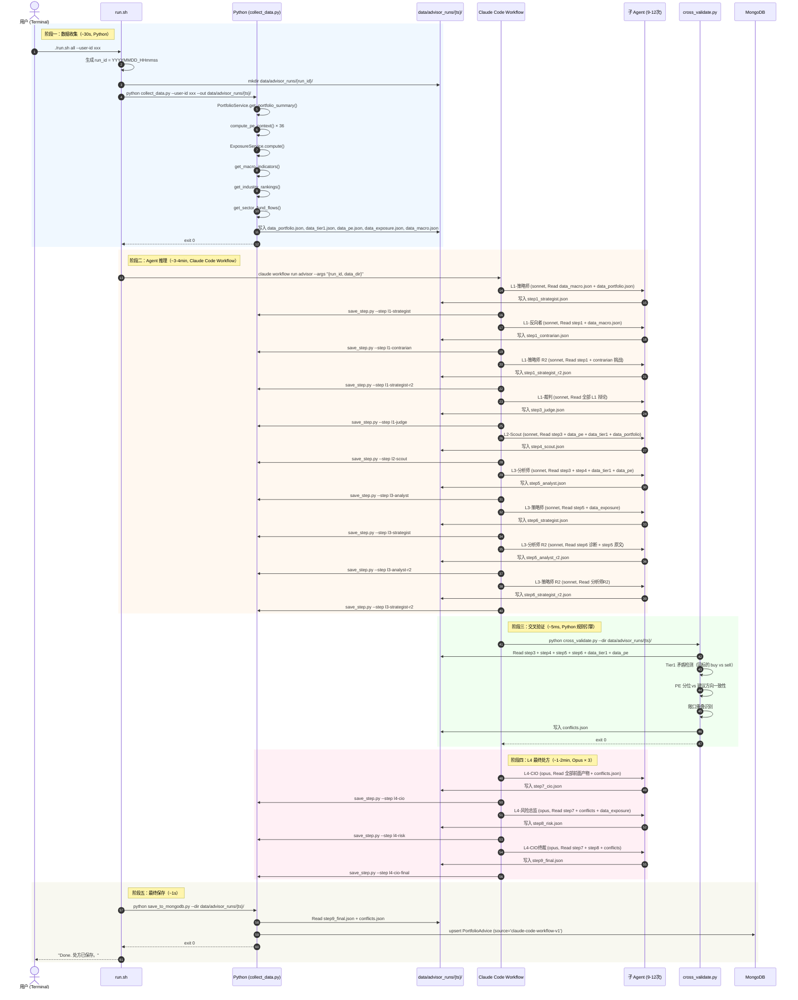

# Claude Code Workflow 组合顾问引擎 — O.A.I.S PRD

---

## O — Objective（业务目标）

- **(P) 现状**：`cli/claude_advisor.py` 用 Python → HTTP → DeepSeek API 扮演 9 个投资分析角色。Claude Code 本身不参与分析，只作为"写代码的工具"。单次分析 ~22 分钟，内容品质对标不上专业投资公司（L1 产出 20 行业仅 1 个 Go、L2 候选 19 只全大蓝筹、L3 策略师报"行业全部为未知"、L4 无资金分配概念）。用户不敢用。

- **(A) 动作**：用 Claude Code Workflow `agent()` 替代 DeepSeek API 调用，每个角色变成独立子 Agent（有独立 system prompt + 独立 session + 独立工具调用能力）。架构不变（9 Agent、4 层辩论、JSON 文件总线、交叉验证规则引擎、渐进式 MongoDB 保存）。本轮不改 LangGraph 原代码（留 fix 分支保留），在新分支 `feature/claude-code-agent-advisor` 上构建。

- **(M) 指标**：

| 指标 | 当前 (DeepSeek) | 目标 (Claude Code Workflow) |
|------|-----------------|---------------------------|
| 单次完整分析时间 | ~22min | ≤ 5min |
| 处方覆盖持仓率 | 36/36 (100%) | 100%（保持） |
| L1 行业覆盖 | 1/20 Go | ≥5 方向，含超配/标配/低配区分 |
| 候选标的非大盘比例 | 0/19 | ≥ 30% |
| Tier1 矛盾检出 | 0 | ≥ 1 |
| 交叉验证检出 | 0 | ≥ 1 |
| 单步 Agent 失败恢复 | 不支持（全部重跑） | 断点续跑 + 自动重试 |

---

## A — Architecture（领域模型与业务流）

### A.1 模块与实体总览

| 实体名称 | 核心属性（简述） | 生命周期起点 | 生命周期终点 | 依赖的上游实体 |
|---------|---------------|-----------|-----------|-------------|
| AgentDefinition | name, model, tools, system_prompt | 写入 `agents/advisor/{name}.md` | 删除文件 | — |
| AdviserRun | run_id, user_id, status, data_dir, started_at, completed_at | `./run.sh all` 启动 | 全部步骤完成或失败 | — |
| AgentStep | step_name, layer, agent_name, input_files, output_file, status, retry_count, model | agent() 调用开始 | agent() 返回或重试耗尽 | AdviserRun, 上级 AgentStep |
| ConflictReport | conflicts[], detected_at | 交叉验证脚本执行 | 写入 conflicts.json | L1/L2/L3 AgentStep 输出 |
| PrescriptionItem | code, action, current_weight, target_weight, timing, suggested_price, capital_source, priority, reasoning | CIO 终裁输出 | MongoDB 写入 | ConflictReport, L1/L2/L3 全部输出 |
| AdviserPrescription | user_id, run_id, prescription[], cio_verdict, created_at | MongoDB 写入 | — | PrescriptionItem[], AdviserRun |

### A.2 领域实体定义

#### 实体 1：AdviserRun

| 属性项 | 定义内容 | 备注说明 |
|--------|---------|---------|
| 实体名称 | 顾问运行 | 一次完整的组合分析执行 |
| 实体编码 | AdviserRun | Python dict + MongoDB document |
| 唯一标识 | run_id | 时间戳生成 `YYYYMMDD_HHmmss` |
| 业务描述 | 记录一次从数据收集到处方生成的全流程执行状态 |

**核心属性定义**：

| 字段名称 | 字段编码 | 数据类型 | 必填 | 业务规则与约束 |
|---------|---------|---------|------|-------------|
| 运行 ID | run_id | String | 是 | 格式 `YYYYMMDD_HHmmss`，全局唯一 |
| 用户 ID | user_id | String | 是 | 对应 Portfolio 的 user_id |
| 状态 | status | Enum | 是 | PENDING → COLLECTING → ANALYZING → SAVING → DONE / FAILED |
| 数据目录 | data_dir | String | 是 | `data/advisor_runs/{run_id}/` |
| 开始时间 | started_at | DateTime | 否 | 状态变为 COLLECTING 时设置 |
| 完成时间 | completed_at | DateTime | 否 | 状态变为 DONE 或 FAILED 时设置 |
| 错误信息 | error_message | String | 否 | 仅在 FAILED 时有值 |

**状态机**：

状态字典：

| 状态名称 | 状态枚举值（Enum） | 业务含义说明 |
|---------|------------------|-----------|
| 待执行 | PENDING | run.sh 已解析参数，尚未开始执行 |
| 采集中 | COLLECTING | 正在调用 Python 工具采集数据 |
| 分析中 | ANALYZING | Workflow 正在运行，Agent 逐个推理 |
| 保存中 | SAVING | Agent 推理完成，正在写 MongoDB |
| 完成 | DONE | 全部步骤成功 |
| 失败 | FAILED | 任意步骤不可恢复地失败 |

状态转移表：

| 当前状态 | 触发事件/动作 | 前置校验条件（Guard） | 目标状态 | 后置动作/副作用 |
|---------|-------------|-------------------|---------|-------------|
| PENDING | `./run.sh` 启动 | user_id 合法，Python 环境可用 | COLLECTING | 创建 data/advisor_runs/{run_id}/ 目录 |
| COLLECTING | `collect_data.py` 完成 | 全部数据文件写入成功 | ANALYZING | 启动 Claude Code Workflow |
| COLLECTING | `collect_data.py` 失败 | — | FAILED | 设置 error_message，记录哪个数据源失败 |
| ANALYZING | Workflow 全部完成 | 12 个 agent() + 交叉验证全部成功 | SAVING | — |
| ANALYZING | Workflow 中断且用户选择跳过 | — | SAVING | 用已有输出文件继续保存 |
| ANALYZING | Workflow 中断且不可恢复 | — | FAILED | 保留中间文件，设置 error_message |
| SAVING | MongoDB 写入成功 | step9_final.json 存在且 schema 验证通过 | DONE | 设置 completed_at |
| SAVING | MongoDB 写入失败 | — | FAILED | 保留所有输出文件，设置 error_message |

#### 实体 2：AgentStep

| 属性项 | 定义内容 | 备注说明 |
|--------|---------|---------|
| 实体名称 | Agent 步骤 | 单个 Agent 的一次调用记录 |
| 实体编码 | AgentStep | JSON 文件 |
| 唯一标识 | step_name | `l1-strategist`, `l1-contrarian`, `l1-judge`, `l2-scout`, `l3-analyst`, `l3-strategist-r1`, `l3-analyst-r2`, `l3-strategist-r2`, `l4-cio`, `l4-risk`, `l4-cio-final` |
| 业务描述 | 记录一个 Agent 的输入文件列表、输出文件、执行状态、模型选择、重试次数 |

**核心属性定义**：

| 字段名称 | 字段编码 | 数据类型 | 必填 | 业务规则与约束 |
|---------|---------|---------|------|-------------|
| 步骤名 | step_name | String | 是 | 唯一标识，格式 `{layer}-{role}[-r{N}]` |
| 层级 | layer | Enum | 是 | L1 / L2 / L3 / L4 |
| Agent 名 | agent_name | String | 是 | 对应 `agents/advisor/{name}.md` |
| 输入文件 | input_files | String[] | 是 | 数据文件 + 上级 Agent 输出文件路径列表 |
| 输出文件 | output_file | String | 是 | `step{N}_{role}.json` |
| 状态 | status | Enum | 是 | PENDING → RUNNING → DONE / RETRYING / FAILED |
| 重试次数 | retry_count | Int | 是 | 默认 0，每次重试 +1，max 2 |
| 模型 | model | Enum | 是 | sonnet / opus（L1-L3 Sonnet, L4 Opus） |
| Schema 验证结果 | schema_valid | Boolean | 否 | 输出是否通过 JSON Schema 验证 |

**状态机**：

| 当前状态 | 触发事件/动作 | 前置校验条件 | 目标状态 | 后置动作/副作用 |
|---------|-------------|------------|---------|-------------|
| PENDING | agent() 调用开始 | 输入文件全部存在 | RUNNING | — |
| RUNNING | agent() 返回 + schema 验证通过 | 输出符合 JSON Schema | DONE | 写输出文件 + 调 save_step.py 写 MongoDB |
| RUNNING | agent() 返回 + schema 验证失败 + retry_count < 2 | — | RETRYING | retry_count++，重新 agent() |
| RETRYING | 重新 agent() | retry_count < 2 | RUNNING | — |
| RUNNING | agent() 返回 + schema 验证失败 + retry_count >= 2 | — | FAILED | 设置 error_message，保留原始输出 |
| RUNNING | agent() 超时或网络错误 | — | FAILED | 保留已完成 Agent 的输出文件 |

#### 实体 3：AgentDefinition

| 属性项 | 定义内容 | 备注说明 |
|--------|---------|---------|
| 实体名称 | Agent 定义 | Claude Code 子 Agent 的配置文件和 system prompt |
| 实体编码 | AgentDefinition | Markdown 文件（YAML frontmatter + body） |
| 唯一标识 | name | `l1-strategist`, `l1-contrarian`, ... |
| 业务描述 | 定义一个投资分析角色的身份、能力（工具）、推理模型和行为规范 |

**核心属性定义**：

| 字段名称 | 字段编码 | 数据类型 | 必填 | 业务规则与约束 |
|---------|---------|---------|------|-------------|
| 名称 | name | String | 是 | 唯一，kebab-case |
| 描述 | description | String | 是 | 用于 Claude Code 自动委托判定 |
| 模型 | model | String | 否 | sonnet（默认）/ opus，L1-L3 不填（继承 sonnet），L4 填 opus |
| 工具列表 | tools | String[] | 是 | `["Read", "Bash"]` — Read 读数据文件，Bash 调 Python 工具 |
| 系统提示 | system prompt (body) | Markdown | 是 | 角色定义 + 输入说明 + 输出 Schema + 思考步骤 |

#### 实体 4：ConflictReport

| 属性项 | 定义内容 | 备注说明 |
|--------|---------|---------|
| 实体名称 | 冲突报告 | 交叉验证规则引擎的输出 |
| 实体编码 | ConflictReport | JSON 文件 `conflicts.json` |
| 唯一标识 | —（附属实体，无独立 ID） | 每个 AdviserRun 最多一份 |
| 业务描述 | 检测 Tier1 矛盾、PE 分位 vs 建议方向不一致、敞口重叠等问题 |

**核心属性定义**：

| 字段名称 | 字段编码 | 数据类型 | 必填 | 业务规则与约束 |
|---------|---------|---------|------|-------------|
| 冲突列表 | conflicts | Object[] | 是 | 每个冲突含 type, code, severity, description |
| 冲突类型 | type | Enum | 是 | tier1_conflict / pe_overvalued / overlap / direction_mismatch |
| 严重度 | severity | Enum | 是 | high / medium / low |
| 相关标的 | code | String | 是 | 涉及的股票/基金代码 |
| 描述 | description | String | 是 | 人类可读的冲突说明 |

### A.3 核心数据流与交互

**触发源**：用户在 tradingagents-cn 项目根目录执行 `./run.sh all`（或 `./run.sh collect` → `./run.sh analyze`）。



### A.4 核心规则与算法

#### 规则 1：交叉验证规则引擎

```
输入：step3_judge.json, step4_scout.json, step5_analyst.json, step6_strategist.json,
      data_tier1.json, data_pe.json, data_exposure.json
输出：conflicts.json

规则 1.1 — Tier1 矛盾检测：
  对每个出现在 ≥2 份 Tier1 报告中的 stock_code：
    如果同时存在 "买入" 和 "卖出" 建议 → 
      conflicts.append({type: "tier1_conflict", code, severity: "high",
        description: "Tier1 报告矛盾: {买入来源} vs {卖出来源}"})

规则 1.2 — PE 高估 vs 买入建议：
  对 step4_scout.json 中每个 candidates 和 step5_analyst.json 中每个被建议"加仓"的持仓：
    如果 data_pe[code].pe_percentile_5y > 85 且 建议方向为"买入/加仓" →
      conflicts.append({type: "pe_overvalued", code, severity: "medium",
        description: "PE 处于 {percentile}% 分位(偏贵)，但建议买入"})

规则 1.3 — 敞口重叠：
  对 data_exposure.json 中 overlaps 数组的每个元素：
    如果 overlap_weight > 15% →
      conflicts.append({type: "overlap", code, severity: "low",
        description: "基金穿透后 {code} 实际敞口 {weight}%，超过 15% 阈值"})
```

#### 算法 1：L2 Scout 评分映射（确定性）

```
输入：Scout 输出的 6 维评分 {business_model, moat, management, financials, valuation, momentum}
输出：推荐等级

total_score = sum(6 维)
映射：
  total >= 35 → "强烈推荐"
  total >= 28 → "推荐"
  total >= 20 → "观察"
  total < 20  → "淘汰"
```

#### 算法 2：市场温度计（水温判定）

```
输入：market_signals.py 输出
输出：水温等级 + CIO timing 建议

水温 = 0
+ 涨跌比 > 70% → +25 (亢奋信号)
+ 涨跌比 < 30% → +25 (恐慌信号)
+ 北向连续5日净流入 → +15
+ 北向连续5日净流出 → +20
+ 融资余额周变化 > +5% → +15 (杠杆加剧)
+ 融资余额周变化 < -5% → +10 (去杠杆)

水温等级：
  0-30   → "恐慌" → CIO timing 倾向 immediate
  31-60  → "中性" → CIO 遵循 PE 分位独立判断
  61-100 → "亢奋" → CIO timing 倾向 conditional / scheduled
```

---

## I — Interface（人机交互层）

### CLI 入口：`./run.sh`

- **交互端**：Terminal (Shell)
- **数据源**：`domains/tradingagents-cn/` 项目根目录

```
用法:
  ./run.sh all [--user-id <id>]
  ./run.sh collect [--user-id <id>]
  ./run.sh analyze --data-dir <path> [--from <step>] [--only <step>]

子命令:
  all       数据收集 + Agent 推理 + MongoDB 保存（全流程）
  collect   只跑数据收集，产出 data/advisor_runs/{ts}/
  analyze   只跑 Agent 推理 + 渐进式保存（需已有数据目录）

参数:
  --user-id     用户 ID，默认 "6a094caea814b57d3357fa0b"
  --data-dir    数据目录路径（analyze 必需）
  --from        从指定 Agent step 开始（断点续跑）
  --only        只跑指定 Agent step（单 Agent 调试）
```

**页面-实体绑定**：不涉及 UI 页面，CLI 入口绑定 AdviserRun 实体。

**权限控制**：无需认证，本地 CLI 执行。

**校验规则**：

| 校验项 | 校验逻辑 | 报错提示 |
|--------|---------|---------|
| user_id | 必须为 24 字符 hex string | `Invalid user_id format` |
| data_dir | 目录必须存在且包含 data_portfolio.json | `data_dir not found or missing data_portfolio.json` |
| --from step | 必须匹配已知 step name | `Unknown step: {name}. Valid: l1-strategist, l1-contrarian, ...` |
| Python 环境 | `python` 可执行且已装依赖 | `Python environment not ready` |
| claude CLI | `claude --version` 返回 ≥ v2.1.154 | `Claude Code v2.1.154+ required for Workflow` |

**前端改动**：零。MongoDB 写入后前端 `/portfolio/overview` 通过 `source='claude-code-workflow-v1'` 过滤展示。

---

## S — Scenarios（边界与异常场景）

| 场景编号 | 场景类型（SECURE） | 场景描述 | 前置条件 | 预期系统行为（前端提示 & 后端处理） |
|---------|------------------|---------|---------|-------------------------------|
| SCN-S-01 | Security | 恶意 user_id 参数注入 | Shell 接收 `--user-id "$(rm -rf /)"` | `run.sh` 校验 user_id 格式（hex string），不匹配直接拒绝。Python 侧使用参数化查询。 |
| SCN-E-01 | Error | AKShare SSL 超时导致基金穿透数据失败 | 数据收集阶段调用 `get_fund_holdings` | `collect_data.py` catch 异常 → 记录 warning 日志 → 继续流程。data_portfolio.json 中标注 `fund_data_partial: true`。CIO 处方中提示"基金穿透数据不完整"。 |
| SCN-E-02 | Error | PE 管道不可用（美股 timezone bug） | 某只美股调用 `compute_pe_context` 抛异常 | 该标的 PE 字段填 `null`，ci_verbose 中标注"数据不可用"，回退使用 MA20 估值。交叉验证跳过该标的 PE 检查。 |
| SCN-E-03 | Error | 单个 agent() 调用超时或 API 错误 | Workflow 中第 N 个 agent() 报错 | `schema` 验证失败 → 自动重试（max 2 次）。重试耗尽 → Workflow 中断，已完成的 Agent 输出文件保留。用户可用 `--from {失败的step}` 断点续跑。 |
| SCN-E-04 | Error | MongoDB 写入失败 | SAVING 阶段 MongoDB 连接拒绝 | `save_to_mongodb.py` 重试 3 次（间隔 2s）。仍失败 → AdviserRun status=FAILED，error_message 记录。**所有 Agent 输出文件保留在 data/advisor_runs/{ts}/，不丢数据。** 用户可手动 `python save_to_mongodb.py --dir ...` 重新入库。 |
| SCN-E-05 | Error | Workflow 脚本语法错误 | Workflow 脚本包含 JS 语法错误 | Claude Code 在 Workflow 启动时 parse 脚本，语法错误会立即报错并拒绝执行。修复脚本后重新 `./run.sh analyze --data-dir ...`。 |
| SCN-C-01 | Concurrency | 同一用户同时跑两次分析 | 两个 Terminal 窗口同时执行 `./run.sh all` | 不同 run_id，各自独立的 data/advisor_runs/{ts}/ 目录。MongoDB 后写入的覆盖先写入的（last-write-wins）。前端展示最新 `created_at` 的处方。 |
| SCN-U-01 | Undo | 用户对处方不满意，想回退到上一版 | MongoDB 中已有 v2 处方，v1 处方在之前的数据目录中 | 每版处方保留独立 run_id + created_at。前端可按时间切换查看历史处方。不提供"删除当前处方"，因为 v1 的数据目录还在。 |
| SCN-R-01 | Restriction | Agent 输出格式不符合 JSON Schema | agent() 返回了自由文本而非结构化 JSON | `schema` 参数强制验证。验证失败 → retry_count++ → 重新 agent()，prompt 中加入"上次输出格式不对，请严格按 Schema 输出"。2 次重试后仍失败 → step status=FAILED。 |
| SCN-R-02 | Restriction | L2 Scout 候选池全部是大盘蓝筹 | Scout 输出 candidates 中 100% 市值 > 500 亿 | Scout prompt 中有硬约束"≥30% 候选来自市值 <500 亿公司"。不符合 → schema 验证失败 → 重试。交叉验证额外检查大盘占比，输出 warning 但不阻断流程。 |
| SCN-E-01 (Edge) | Edge | 用户持仓为空（新用户） | data_portfolio.json 中 positions = [] | `collect_data.py` 检测空持仓 → 退出并提示"当前用户无持仓数据，无法进行分析"。不创建 AdviserRun。 |
| SCN-E-02 (Edge) | Edge | data_portfolio.json 超过 50KB（大量持仓） | 用户持有 >100 只标的 | `collect_data.py` 不做限制。Agent 的 prompt 中只写文件路径，Agent 自己 Read——大文件对 Agent 上下文的影响可控（Agent 可以只读需要的部分）。 |
| SCN-E-03 (Edge) | Edge | 某只标的所有数据源都拿不到 PE | PE 分位、MA20、DCF 估值全部失败 | PE 字段 `null`，valuation 标注"数据不足"。Scout 评分中 financials 维度降权。CIO 对该标的的处方 timing 默认为 `conditional`。 |

---

## 自检矩阵

| 检查项 | 检查方法 | 结果 |
|--------|---------|------|
| 状态机完整性 | AdviserRun 和 AgentStep 的状态转移表是否覆盖所有合法路径？ | ✅ AdviserRun 6 状态 8 转移，AgentStep 4 状态 5 转移，无孤立状态 |
| 数据流-状态机一致性 | A.3 时序图每个状态变更是否在 A.2 状态转移表中有对应？ | ✅ 时序图 5 阶段对应状态转移路径 |
| 界面-实体绑定 | I 层 CLI 是否绑定 AdviserRun 实体？ | ✅ run.sh → AdviserRun |
| 按钮-事件链路 | CLI 子命令是否触发 AdviserRun 状态转移？ | ✅ all → PENDING→COLLECTING, analyze → ANALYZING |
| 场景覆盖度 | S 层是否覆盖 A.3 数据流中每个异常分支？ | ✅ 覆盖了 AKShare 超时、PE 失败、Agent 失败、MongoDB 失败、Workflow 语法错误、并发、空持仓 |
| O-M 可验证性 | M 指标是否可通过系统数据验证？ | ✅ 时间（AdviserRun.completed_at - started_at）、覆盖率（prescription.length vs positions.length）、检出数（conflicts.length） |
| 实体关系一致性 | A.2 关系拓扑是否与 A.1 总览和 A.3 数据流一致？ | ✅ AgentStep 依赖 AdviserRun → ConflictReport 依赖 AgentStep → PrescriptionItem 依赖 ConflictReport |

---

## 文件产出清单

```
domains/tradingagents-cn/
├── agents/advisor/
│   ├── l1-strategist.md          Agent 1: 市场策略师（看多）
│   ├── l1-contrarian.md          Agent 2: 反向者（看空）
│   ├── l1-judge.md               Agent 3: 宏观裁判
│   ├── l2-scout.md               Agent 4: Scout（6维评分）
│   ├── l3-analyst.md             Agent 5: 持仓分析师
│   ├── l3-strategist.md          Agent 6: 组合策略师（诊断报告员）
│   ├── l4-cio.md                 Agent 7: CIO 初稿
│   ├── l4-risk.md                Agent 8: 风险总监
│   └── l4-cio-final.md           Agent 9: CIO 终裁
├── scripts/
│   ├── run.sh                    总入口（collect / analyze / all）
│   ├── collect_data.py           数据收集（已有，需适配新输出路径）
│   ├── cross_validate.py         交叉验证规则引擎
│   ├── save_step.py              渐进式保存（单步 Agent 输出 → MongoDB）
│   └── save_to_mongodb.py        最终处方保存
├── setup.sh                      cp -r agents/advisor/ → .claude/agents/advisor/
├── data/advisor_runs/            [gitignored] 运行时产出目录
│   └── {run_id}/
│       ├── data_portfolio.json
│       ├── data_tier1.json
│       ├── data_pe.json
│       ├── data_exposure.json
│       ├── data_macro.json
│       ├── step1_strategist.json
│       ├── ...（中间 Agent 输出）
│       ├── step9_final.json
│       └── conflicts.json
└── .claude/agents/advisor/       [gitignored, setup.sh 生成]
    └── *.md                      （从 agents/advisor/ 复制）
```

---

## O.A.I.S 规范反馈

无。本 PRD 完全遵循 v1.1.0 规范。
